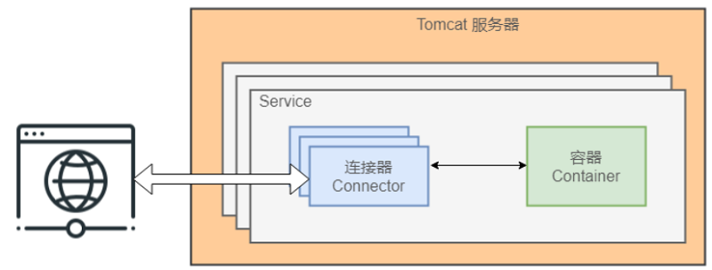
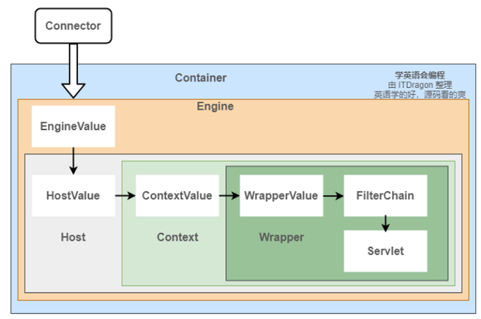

# SpringBoot 使用外部 Tomcat

## 代码地址

- Gitee: https://gitee.com/Awaion/tools
- Github: https://github.com/Awaion/tools

## 简介

当项目运行背景是必须要使运行代码和 Web 服务器剥离时,我们就需要考虑如何改造可以在外部 Tomcat 上运行.

## Tomcat

Tomcat 是一个流行的开源 Java Servlet 容器,实现了 Java Servlet 和 JavaServer Pages 规范,用于服务 HTTP 请求.

Tomcat 主要组件

- 服务器(Server):为服务(Service)提供运行环境.
- 容器(Container):负责处理请求|管理 Servlet 生命周期等.容器由四个子容器组件构成,分别是 Engine|Host|Context 和
  Wrapper,它们之间存在包含关系.
- 连接器(Connector):负责接收客户端发送的请求,并返回响应数据.它是 Tomcat 中两个核心组件之一.
- 服务(Service):由一个或多个连接器(Connector)和一个容器(Container)组成,用于处理请求并提供服务.



Tomcat 请求处理流程

- 当一个请求到达 Tomcat 时,首先由 Connector 组件接收请求.
- Connector 将请求封装成 Request 和 Response 对象,然后创建一个线程来处理这个请求.
- 处理请求的线程将 Request 和 Response 对象传递给 Container 组件.
- Container 组件按照责任链模式,依次经过 Engine|Host|Context 和 Wrapper 容器处理请求.
- 最终,请求被转发到相应的 Servlet 进行处理.



Tomcat 优化

JVM

- 堆大小,默认最小1/64 1/4 -Xms512m -Xmx1024m
- 新生代与老年代,默认值堆内存的1/3 -Xmn
- Eden与Survivor,默认值8:1:1 -XX:SurvivorRatio
- 元空间,默认最小128KB,最大无限制 -XX:MetaspaceSize -XX:MaxMetaspaceSize
- 垃圾回收器,默认8 Parallel GC,17 G1GC -XX:+UseG1GC(大堆内存) 或 -XX:+UseParallelGC(多核CPU)
- 并行GC线程数 -XX:ParallelGCThreads=4
- 元空间大小 -XX:MetaspaceSize=128m -XX:MaxMetaspaceSize=256m

配置

```xml
<!--压缩,默认关闭-->
<Connector port="8080" protocol="HTTP/1.1"
           connectionTimeout="20000"
           redirectPort="8443"
           compression="on"
           compressionMinSize="2048"
           compressableMimeType="text/html,text/xml,text/plain,application/json"/>
```

```xml
<!--NIO2-->
<Connector port="8080" protocol="org.apache.coyote.http11.Http11Nio2Protocol"
           connectionTimeout="20000"
           redirectPort="8443"
           maxThreads="200"
           acceptCount="100"/>
```

```xml
<!--线程池-->
<Connector port="8080" protocol="HTTP/1.1"
           connectionTimeout="20000"
           redirectPort="8443"
           maxThreads="200"
           minSpareThreads="20"
           acceptCount="100"/>
```

```text
<!--缓存-->
<Resources cachingAllowed="true" cacheMaxSize="100000" />
<Cache maxEntries="1000" maxAge="3600" />

response.setHeader("Cache-Control", "max-age=3600");
response.setDateHeader("Expires", System.currentTimeMillis() + 3600 * 1000);
```

- https://tomcat.apache.org/

## 演示

本地服务启动访问地址:http://localhost


## 集成步骤

1. pom.xml

```
<packaging>war</packaging>

<dependency>
    <groupId>org.springframework.boot</groupId>
    <artifactId>spring-boot-starter-web</artifactId>
    <exclusions>
        <!-- 移除内嵌tomcat -->
        <exclusion>
            <groupId>org.springframework.boot</groupId>
            <artifactId>spring-boot-starter-tomcat</artifactId>
        </exclusion>
    </exclusions>
</dependency>

<!-- 给idea运行main时使用,打包时不使用 -->
<dependency>
    <groupId>org.springframework.boot</groupId>
    <artifactId>spring-boot-starter-tomcat</artifactId>
    <scope>provided</scope>
</dependency>
```

2. Demo001Application.java 继承 SpringBootServletInitializer 类,并重写 configure 方法

```code
@SpringBootApplication
public class Demo001Application extends SpringBootServletInitializer {

    @Override
    protected SpringApplicationBuilder configure(SpringApplicationBuilder builder) {
        // 外部tomcat启动需要调用初始化资源
        return builder.sources(Demo001Application.class);
    }

}
```

3. 打包项目

``` code
mvn clean package -Dmaven.test.skip=true
```

## 技术说明

#### 后端

| 技术         | 说明        | 官网                                     |
|------------|-----------|----------------------------------------|
| SpringBoot | Web应用开发框架 | https://spring.io/projects/spring-boot |

#### 开发工具

| 工具   | 说明    | 官网                                      |
|------|-------|-----------------------------------------|
| IDEA | 开发IDE | https://www.jetbrains.com/idea/download |

#### 开发环境

| 工具  | 版本号 | 下载                                                                                   |
|-----|-----|--------------------------------------------------------------------------------------|
| JDK | 1.8 | https://www.oracle.com/technetwork/java/javase/downloads/jdk8-downloads-2133151.html |

#### 启动方式

1. 使用idea打开此代码并打包
2. 将war包丢入tomcat/webapps中
3. 启动tomcat,访问 http://localhost:8080/demo001-springboot-tomcat-0.0.1-SNAPSHOT

## 许可证

[MIT License](https://opensource.org/license/mit)

Copyright (c) 2024-2024 awaion

