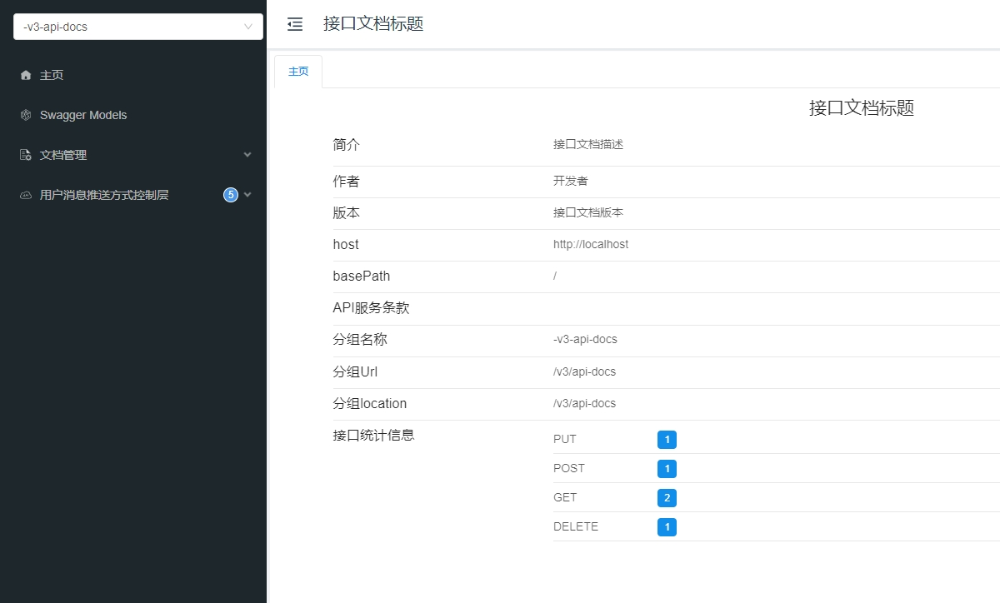

# SpringBoot + Knife4j

## 代码地址

- Gitee: https://gitee.com/Awaion/tools
- Github: https://github.com/Awaion/tools

## 简介

Swagger 接口文档自动生成框架早已深入人心,并且在市场上得到了广泛的应用,然而 Swagger3.0 也就是 OpenApi3.0 规范发布之后便停止了更新维护.
Knife4j 是 Swagger 的增强版,对 Swagger UI 做了优化,同时还有很多增强的功能.如今 Knife4j 从 4.0 开始已经逐渐使用 SpringDoc 作为 
Swagger 的替代.SpringDoc 针对 OpenApi3.0 的适配做了较大的调整,其中注解与 Swagger2 基本不通用.对于新项目而言,使用社区维护活跃的开源框架显
得非常重要.本文将介绍基于 SpringBoot2.7 集成 Knife4j4.3.

Knife4j官方文档: https://doc.xiaominfo.com/docs/quick-start

Springdoc官方文档: https://springdoc.org

## 项目演示

本地服务启动访问地址：http://localhost/doc.html



## 技术点

1. pom.xml 新增 knife4j-openapi3-spring-boot-starter 依赖

``` code
<!-- knife4j-openapi3 -->
<dependency>
    <groupId>com.github.xiaoymin</groupId>
    <artifactId>knife4j-openapi3-spring-boot-starter</artifactId>
    <version>4.3.0</version>
</dependency>
```

2. OpenApiConfig.java 标题,描述等信息

```code
@Configuration
public class OpenApiConfig {

    @Bean
    public OpenAPI springShopOpenAPI() {
        return new OpenAPI()
                .info(new Info().title("接口文档标题")
                        .description("接口文档描述")
                        .version("接口文档版本")
                        .contact(new Contact().name("开发者").url("联系方式")))
                .externalDocs(new ExternalDocumentation()
                        .description("说明")
                        .url("链接"));
    }

}
```

3. 文档注解标注

``` code
@Tag(name = "用户消息推送方式控制层")
public class Demo002Controller {

@Operation(summary = "用户消息推送方式保存(单条)")
public ResponseEntity<ApiResult<UserPushTypeEntity>> save(

@Schema(description = "用户消息推送方式")
public class UserPushTypeEntity {

@Schema(description = "用户id")
private Long userId;
```

4. Swagger 注解替换

``` code
@Api → @Tag
@ApiIgnore → @Parameter(hidden = true) or @Operation(hidden = true) or @Hidden
@ApiImplicitParam → @Parameter
@ApiImplicitParams → @Parameters
@ApiModel → @Schema
@ApiModelProperty(hidden = true) → @Schema(accessMode = READ_ONLY)
@ApiModelProperty → @Schema
@ApiOperation(value = "foo", notes = "bar") → @Operation(summary = "foo", description = "bar")
@ApiParam → @Parameter
@ApiResponse(code = 404, message = "foo") → @ApiResponse(responseCode = "404", description = "foo")
```

## 技术说明

#### 后端

| 技术                 | 说明                | 官网                                           |
| -------------------- | ------------------- | ---------------------------------------------- |
| SpringBoot           | Web应用开发框架      | https://spring.io/projects/spring-boot         |

#### 前端

| 技术         | 说明                   | 官网                                   |
| ----------  | ---------------------  | -------------------------------------- |
| Bootstrap4  | 前端框架               | https://www.bootcss.com/               |
| jQuery3     | 路由框架               | https://blog.jquery.com/               |

#### 开发

| 工具          | 说明                | 官网                                            |
| ------------- | ------------------- | ----------------------------------------------- |
| IDEA          | 开发IDE             | https://www.jetbrains.com/idea/download         |

#### 开发环境

| 工具          | 版本号  | 下载                                                                                 |
| ------------- | ------ | ------------------------------------------------------------                         |
| JDK           | 1.8    | https://www.oracle.com/technetwork/java/javase/downloads/jdk8-downloads-2133151.html |


#### 启动方式

main方法启动

## 许可证

[MIT License](https://opensource.org/license/mit)

Copyright (c) 2024-2024 Awaion

