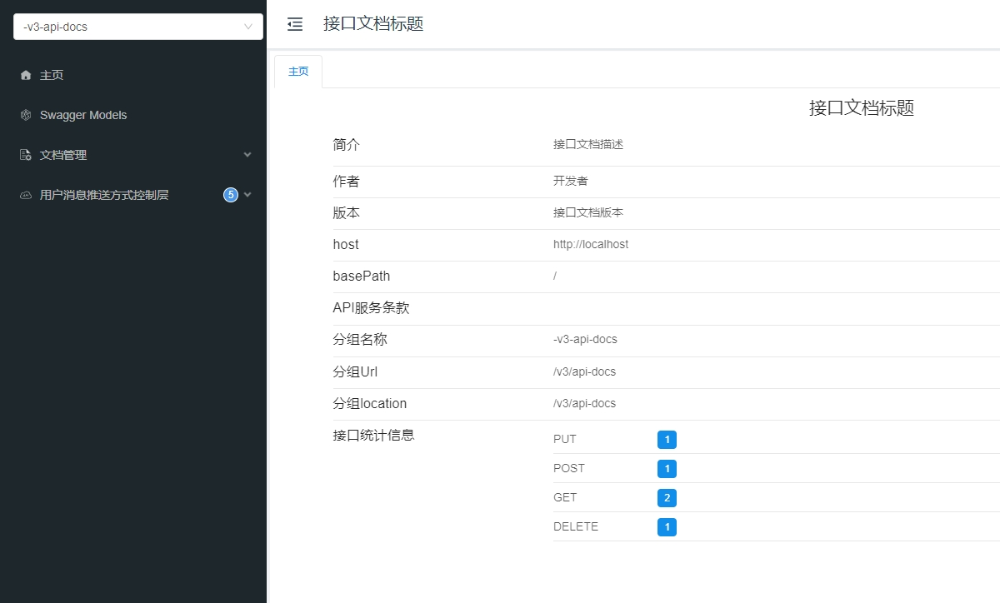

# springboot相关知识点

## 友情提示
> 1. **代码地址**：[码云](https://gitee.com/explore) 。

## 前言
`awaken`项目致力于基于SpringBoot基础上,集成各种技术框架,用于理解框架集成原理。

## 项目文档
文档地址：[https://gitee.com/explore](https://gitee.com/explore)

## 当前项目介绍
> SpringBoot 集成Knife4j + SpringDoc OpenApi3.0

> Swagger接口文档自动生成框架早已深入人心,并且在市场上得到了广泛的应用,然而Swagger3.0也就是OpenApi3.0规范发布之后便停止了更新
维护.Knife4j是Swagger的增强版,对SwaggerUI做了优化,同时还有很多增强的功能.如今Knife4j从4.0开始已经逐渐使用SpringDoc作为Swagger
的替代.SpringDoc针对OpenApi3.0的适配做了较大的调整,其中注解与Swagger2基本不通用.对于新项目而言,使用社区维护活跃的开源框架显得
非常重要.本文将介绍基于SpringBoot2.7集成Knife4j4.3 + SpringDoc OpenApi3.0.

> Knife4j官方文档: https://doc.xiaominfo.com/docs/quick-start

> Springdoc官方文档: https://springdoc.org

### 项目演示
本地服务启动访问地址：http://localhost/doc.html


### 技术点
1. pom.xml 新增knife4j-openapi3依赖
``` code
<!-- knife4j-openapi3 -->
<dependency>
    <groupId>com.github.xiaoymin</groupId>
    <artifactId>knife4j-openapi3-spring-boot-starter</artifactId>
    <version>4.3.0</version>
</dependency>
```

2. OpenApiConfig.java 标题,描述等信息
```code
@Configuration
public class OpenApiConfig {

    @Bean
    public OpenAPI springShopOpenAPI() {
        return new OpenAPI()
                .info(new Info().title("接口文档标题")
                        .description("接口文档描述")
                        .version("接口文档版本")
                        .contact(new Contact().name("开发者").url("联系方式")))
                .externalDocs(new ExternalDocumentation()
                        .description("说明")
                        .url("链接"));
    }

}
```

3. 文档注解标注
``` code
@Tag(name = "用户消息推送方式控制层")
public class Demo002Controller {

@Operation(summary = "用户消息推送方式保存(单条)")
public ResponseEntity<ApiResult<UserPushTypeEntity>> save(

@Schema(description = "用户消息推送方式")
public class UserPushTypeEntity {

@Schema(description = "用户id")
private Long userId;
```

### 技术选型
#### 后端技术
| 技术                 | 说明                | 官网                                           |
| -------------------- | ------------------- | ---------------------------------------------- |
| SpringBoot           | Web应用开发框架      | https://spring.io/projects/spring-boot         |

#### 前端技术
| 技术         | 说明                   | 官网                                   |
| ----------  | ---------------------  | -------------------------------------- |
| Bootstrap4  | 前端框架               | https://www.bootcss.com/               |
| jQuery3     | 路由框架               | https://blog.jquery.com/               |

#### 架构图
##### 系统架构图
loading...

## 环境搭建
### 开发工具
| 工具          | 说明                | 官网                                            |
| ------------- | ------------------- | ----------------------------------------------- |
| IDEA          | 开发IDE             | https://www.jetbrains.com/idea/download         |

### 开发环境
| 工具          | 版本号  | 下载                                                                                 |
| ------------- | ------ | ------------------------------------------------------------                         |
| JDK           | 1.8    | https://www.oracle.com/technetwork/java/javase/downloads/jdk8-downloads-2133151.html |


### 搭建步骤
> Windows环境启动
- main方法启动

## 许可证
[Apache License 2.0](https://github.com/macrozheng/mall/blob/master/LICENSE)

Copyright (c) 2024-2024 Awaion

