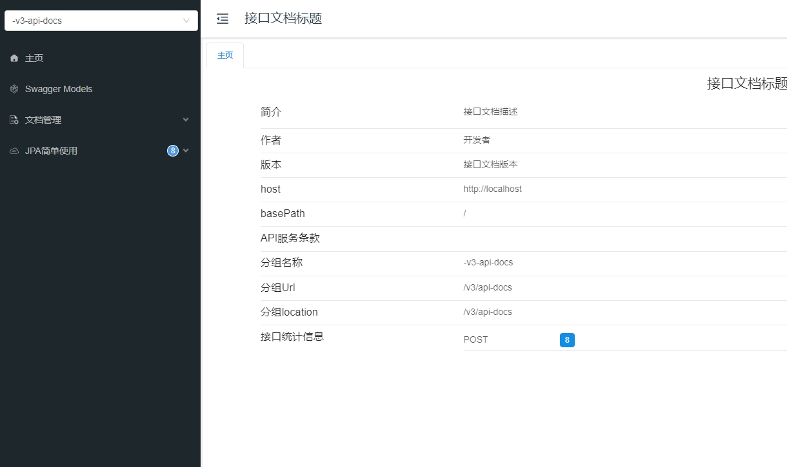

# Spring Boot + Spring Data JPA

## 代码地址

- Gitee: https://gitee.com/Awaion/tools/tree/master/demo003
- Github: https://github.com/Awaion/tools/tree/master/demo003

## 简介

Spring Data JPA 是 Spring Data 项目家族中的一员,它为基于Spring框架应用程序提供了更加便捷和强大的数据操作方式.

Spring Data JPA 支持多种数据存储技术,包括关系型数据库和非关系型数据库.

Spring Data JPA 提供了简单/一致且易于使用的API来访问和操作数据存储,其中包括基本的CRUD操作/自定义查询方法/动态查询等功能.

Spring Data JPA 也支持QueryDSL/Jinq/Kotlin Query等其他查询框架

Spring Data JPA 官方文档: https://spring.io/projects/spring-data-jpa

## 演示

本地服务启动访问地址：http://localhost/doc.html



## 集成步骤

1. pom.xml 新增 Spring Data JPA 依赖

```
<!-- spring-data-jpa,内置hikari -->
<dependency>
    <groupId>org.springframework.boot</groupId>
    <artifactId>spring-boot-starter-data-jpa</artifactId>
</dependency>
```

2. application.yaml 新增数据库及相关配置

```
# 数据库连接基础配置
spring:
  datasource:
    url: jdbc:mysql://localhost:3306/jpa?useUnicode=true&characterEncoding=utf8&serverTimezone=Asia/Shanghai
    username: root
    password: 123456
    driver-class-name: com.mysql.cj.jdbc.Driver
    hikari:
      idle-timeout: 30000
      connection-timeout: 10000
      maximum-pool-size: 15
      minimum-idle: 5
      auto-commit: true
  jpa:
    hibernate:
      ddl-auto: update
    show-sql: true
    database-platform: org.hibernate.dialect.MySQL55Dialect
```

3. 持久层继承接口

```
@Repository
public interface StudentRepository extends JpaRepository<Student, Integer> {
```

4. 实体类使用注解

```
@Entity
public class Student {
    @Id
    @GeneratedValue(strategy = GenerationType.IDENTITY)
    private Long id;

    @Column(length = 100)
    private String name;
```

## 技术说明

#### 后端

| 技术                 | 说明                | 官网                                           |
| -------------------- | ------------------- | ---------------------------------------------- |
| SpringBoot           | Web应用开发框架      | https://spring.io/projects/spring-boot         |

#### 前端

| 技术         | 说明                   | 官网                                   |
| ----------  | ---------------------  | -------------------------------------- |
| Bootstrap4  | 前端框架               | https://www.bootcss.com/               |
| jQuery3     | 路由框架               | https://blog.jquery.com/               |

#### 开发工具

| 工具          | 说明                | 官网                                            |
| ------------- | ------------------- | ----------------------------------------------- |
| IDEA          | 开发IDE             | https://www.jetbrains.com/idea/download         |

#### 开发环境

| 工具          | 版本号  | 下载                                                                                 |
| ------------- | ------ | ------------------------------------------------------------                         |
| JDK           | 1.8    | https://www.oracle.com/technetwork/java/javase/downloads/jdk8-downloads-2133151.html |

#### 启动方式

main方法启动

## 许可证

[MIT License](https://opensource.org/license/mit)

Copyright (c) 2024-2024 Awaion

