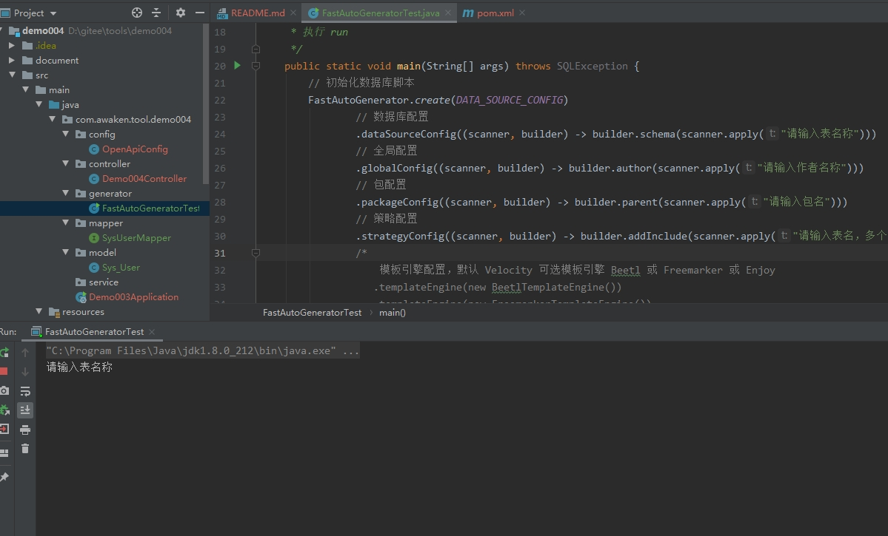

# Spring Boot + MyBatis-Plus

## 代码地址

- Gitee: https://gitee.com/Awaion/tools/tree/master/demo004
- Github: https://github.com/Awaion/tools/tree/master/demo004

## 简介

MyBatis-Plus 是一个 MyBatis 的增强工具,在 MyBatis 的基础上只做增强不做改变,为简化开发/提高效率而生.
- 无侵入: 只做增强不做改变,引入它不会对现有工程产生影响,如丝般顺滑.
- 损耗小: 启动即会自动注入基本 CURD,性能基本无损耗,直接面向对象操作.
- 强大的 CRUD 操作: 内置通用 Mapper/通用 Service,仅仅通过少量配置即可实现单表大部分 CRUD 操作,更有强大的条件构造器,满足各
类使用需求
- 支持 Lambda 形式调用:通过 Lambda 表达式,方便的编写各类查询条件,无需再担心字段写错.
- 支持主键自动生成: 支持多达 4 种主键策略(内含分布式唯一 ID 生成器 - Sequence),可自由配置,完美解决主键问题.
- 支持 ActiveRecord 模式:支持 ActiveRecord 形式调用,实体类只需继承 Model 类即可进行强大的 CRUD 操作.
- 支持自定义全局通用操作:支持全局通用方法注入(Write once, use anywhere).
- 内置代码生成器:采用代码或者 Maven 插件可快速生成 Mapper / Model / Service / Controller 层代码,支持模板引擎,更有超多自定
义配置等您来使用.
- 内置分页插件:基于 MyBatis 物理分页,开发者无需关心具体操作,配置好插件之后,写分页等同于普通 List 查询.
- 分页插件支持多种数据库:支持 MySQL/MariaDB/Oracle/DB2/H2/HSQL/SQLite/Postgre/SQLServer 等多种数据库
- 内置性能分析插件:可输出 SQL 语句以及其执行时间,建议开发测试时启用该功能,能快速揪出慢查询.
- 内置全局拦截插件:提供全表 delete / update 操作智能分析阻断,也可自定义拦截规则,预防误操作.
- 官方文档: https://baomidou.com/

## 演示




### 集成步骤

1. pom.xml 新增 Spring Data JPA 依赖

```
<!-- mybatis-plus -->
<dependency>
    <groupId>com.baomidou</groupId>
    <artifactId>mybatis-plus-boot-starter</artifactId>
    <version>3.5.4</version>
</dependency>

<!-- MySQL Connector -->
<dependency>
    <groupId>mysql</groupId>
    <artifactId>mysql-connector-java</artifactId>
    <scope>runtime</scope>
</dependency>

<!-- mybatis-plus-generator -->
<dependency>
    <groupId>com.baomidou</groupId>
    <artifactId>mybatis-plus-generator</artifactId>
    <version>3.5.4</version>
</dependency>

<!-- 代码生成需要用到的模版引擎velocity -->
<dependency>
    <groupId>org.apache.velocity</groupId>
    <artifactId>velocity-engine-core</artifactId>
    <version>2.0</version>
</dependency>
```

2. application.yaml 新增数据库及相关配置

```
# 数据库连接基础配置
spring:
  datasource:
    username: root
    password: test
    driver-class-name: org.h2.Driver
  sql:
    init:
      schema-locations: classpath:db/schema-h2.sql
      data-locations: classpath:db/data-h2.sql
```

3. 持久层继承接口

```code
public interface SysUserMapper extends BaseMapper<Sys_User> {
```

4. 实体类使用注解

``` code
@TableName("`sys_user`")
public class Sys_User {
```

### 技术说明

#### 后端

| 技术                 | 说明                | 官网                                           |
| -------------------- | ------------------- | ---------------------------------------------- |
| SpringBoot           | Web应用开发框架     | https://spring.io/projects/spring-boot         |
| MyBatis-Plus         | 持久层框架          | https://baomidou.com                           |

#### 前端

| 技术         | 说明                   | 官网                                   |
| ----------  | ---------------------  | -------------------------------------- |
| Bootstrap4  | 前端框架               | https://www.bootcss.com/               |
| jQuery3     | 路由框架               | https://blog.jquery.com/               |

#### 开发工具

| 工具          | 说明                | 官网                                            |
| ------------- | ------------------- | ----------------------------------------------- |
| IDEA          | 开发IDE             | https://www.jetbrains.com/idea/download         |

#### 开发环境

| 工具          | 版本号  | 下载                                                                                 |
| ------------- | ------ | ------------------------------------------------------------                         |
| JDK           | 1.8    | https://www.oracle.com/technetwork/java/javase/downloads/jdk8-downloads-2133151.html |

#### 启动方式

main方法启动

## 许可证

[MIT License](https://opensource.org/license/mit)

Copyright (c) 2024-2024 Awaion

