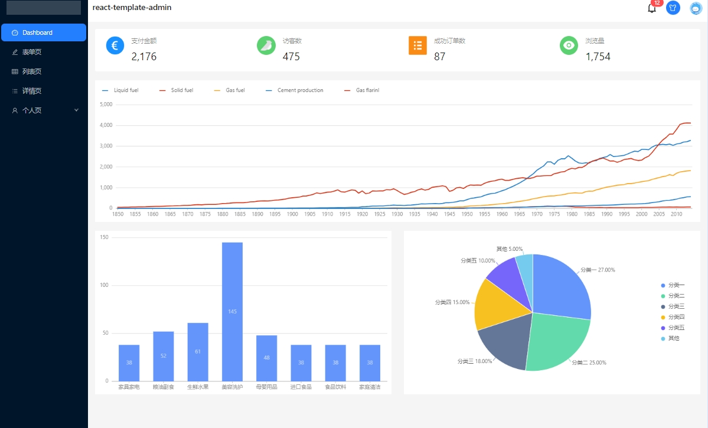

# Spring Boot + React 18

## 代码地址

- Gitee: https://gitee.com/Awaion/tools/tree/master/demo006
- Github: https://github.com/Awaion/tools/tree/master/demo006

## 简介

React开发的前端代码在打包后本质上还是html,css,js等浏览器可解析的文件,将打包文件放入静态文件夹即可

前端代码地址(感谢分享): https://github.com/panyushan-jade/react-template-admin

React.js官方文档: https://react.docschina.org/

## 演示

本地服务启动访问地址：http://localhost



## 集成步骤

1. 将 React 打包好的前端文件放在 resources/static 目录下

2. pom.xml 新增web依赖

```xml
<dependency>
    <groupId>org.springframework.boot</groupId>
    <artifactId>spring-boot-starter-web</artifactId>
</dependency>
```

## 技术说明

#### 后端

| 技术                 | 说明                | 官网                                           |
| -------------------- | ------------------- | ---------------------------------------------- |
| SpringBoot           | Web应用开发框架      | https://spring.io/projects/spring-boot         |

#### 前端

| 技术                    | 说明                   | 官网                                                     |
| ----------              | ---------------------  | --------------------------------------                  |
| React.js                | 前端框架               | https://react.docschina.org/                             |
| react-template-admin    | 前端模版               | https://github.com/panyushan-jade/react-template-admin   |

#### 开发工具

| 工具          | 说明                | 官网                                            |
| ------------- | ------------------- | ----------------------------------------------- |
| IDEA          | 开发IDE             | https://www.jetbrains.com/idea/download         |
| VSCode        | 开发IDE             | https://code.visualstudio.com/                  |

#### 开发环境

| 工具          | 版本号  | 下载                                                                                 |
| ------------- | ------ | ------------------------------------------------------------                         |
| JDK           | 1.8    | https://www.oracle.com/technetwork/java/javase/downloads/jdk8-downloads-2133151.html |
| React.js      | 18     | https://react.docschina.org/                                                         |
| Node.js       | v20    | https://nodejs.org/en                                                                |

#### 启动方式

main方法启动

## 许可证

[MIT License](https://opensource.org/license/mit)

Copyright (c) 2024-2024 Awaion

