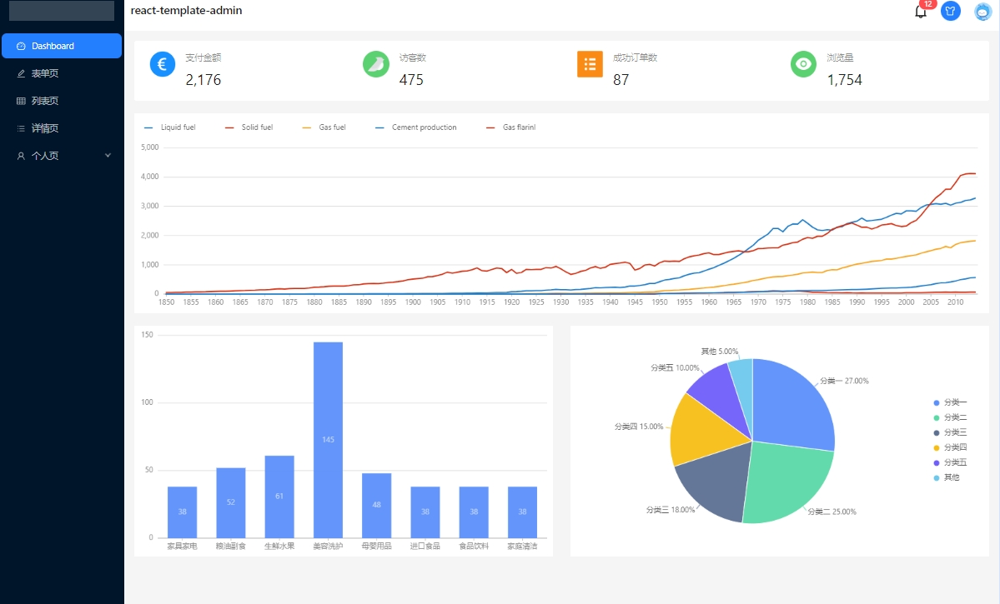

# springboot相关知识点

## 友情提示
> 1. **代码地址**：[码云](https://gitee.com/explore) 。

## 前言
`awaken`项目致力于基于SpringBoot基础上,集成各种技术框架,用于理解框架集成原理。

## 项目文档
文档地址：[https://gitee.com/explore](https://gitee.com/explore)

## 当前项目介绍
> SpringBoot 集成 React18

> React开发的前端代码在打包后本质上还是html,css,js等浏览器可解析的文件,将打包文件放入静态文件夹即可

> 前端使用mock服务器模拟api,这里在控制器把请求重新发给mock,然后响应给前端

> 前端代码地址(感谢分享): https://github.com/panyushan-jade/react-template-admin

> React.js官方文档: https://react.docschina.org/

### 项目演示
本地服务启动访问地址：http://localhost


### 技术点
1. pom.xml 新增web依赖
```xml
<dependency>
    <groupId>org.springframework.boot</groupId>
    <artifactId>spring-boot-starter-web</artifactId>
</dependency>
```

### 技术选型
#### 后端技术
| 技术                 | 说明                | 官网                                           |
| -------------------- | ------------------- | ---------------------------------------------- |
| SpringBoot           | Web应用开发框架      | https://spring.io/projects/spring-boot         |

#### 前端技术
| 技术                    | 说明                   | 官网                                                     |
| ----------              | ---------------------  | --------------------------------------                  |
| React.js                | 前端框架               | https://react.docschina.org/                             |
| react-template-admin    | 前端模版               | https://github.com/panyushan-jade/react-template-admin   |

#### 架构图
##### 系统架构图
loading...

## 环境搭建
### 开发工具
| 工具          | 说明                | 官网                                            |
| ------------- | ------------------- | ----------------------------------------------- |
| IDEA          | 开发IDE             | https://www.jetbrains.com/idea/download         |
| VSCode        | 开发IDE             | https://code.visualstudio.com/                  |

### 开发环境
| 工具          | 版本号  | 下载                                                                                 |
| ------------- | ------ | ------------------------------------------------------------                         |
| JDK           | 1.8    | https://www.oracle.com/technetwork/java/javase/downloads/jdk8-downloads-2133151.html |
| React.js      | 18     | https://react.docschina.org/                                                         |
| Node.js       | v20    | https://nodejs.org/en                                                                |


### 搭建步骤
> Windows环境启动
- main方法启动

## 许可证
[Apache License 2.0](https://github.com/macrozheng/mall/blob/master/LICENSE)

Copyright (c) 2024-2024 Awaion

