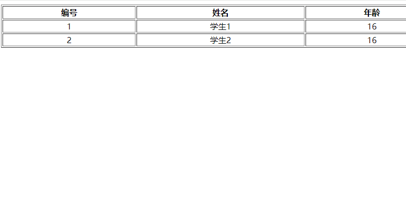

# 无框架 Java Web

## 代码地址

- Gitee: https://gitee.com/Awaion/tools/tree/master/demo007
- Github: https://github.com/Awaion/tools/tree/master/demo007

## 简介

- 无框架 Java Web 项目如何运行
- 需要依赖 MySQL , Tomcat
- 一个古老的项目

## 演示

本地服务启动访问地址：http://localhost:8080/demo007_Web_exploded/student/list

## 集成步骤

说明: https://awaion.github.io/01_enterprise/0001_java_web.html

## 技术说明

#### 后端

| 技术                 | 说明                | 官网                                           |
| --------------------| ------------------- | ---------------------------------------------- |
| JDBC               | Java技术             | https://dev.java/learn/         |
| Servlet            | Java技术             | https://dev.java/learn/         |

#### 前端

| 技术         | 说明                   | 官网                                               |
| ----------   | ---------------------  | --------------------------------------            |
| html/css/js/jsp       | 前端语言               | https://www.w3.org/                             |

#### 开发工具

| 工具          | 说明                | 官网                                            |
| ------------- | ------------------- | ----------------------------------------------- |
| IDEA          | 开发IDE             | https://www.jetbrains.com/idea/download         |

#### 开发环境

| 工具          | 版本号  | 下载                                                                                 |
| ------------- | ------ | ------------------------------------------------------------                         |
| JDK           | 1.8    | https://www.oracle.com/technetwork/java/javase/downloads/jdk8-downloads-2133151.html |

#### 启动方式

Tomcat服务启动

## 许可证

[MIT License](https://opensource.org/license/mit)

Copyright (c) 2024-2024 Awaion

