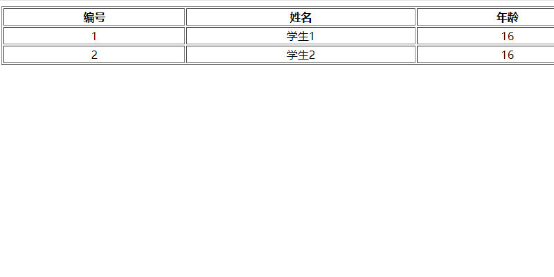

# Java相关知识点

## 友情提示
> 1. **代码地址**：[Github](https://github.com/Awaion/tools) 。

## 前言
`awaken`项目致力于基于Java基础上,集成各种技术框架,用于理解框架集成原理。

## 项目文档
文档地址：[https://github.com/Awaion/tools](https://github.com/Awaion/tools)

## 当前项目介绍
- 没有框架的Java Web项目如何运行
- 需要依赖`MySQL`, `Tomcat`
- 这是一个古老的项目

### 项目演示
本地服务启动访问地址：http://localhost:8080/demo007_Web_exploded/student/list

### 技术点
1. web.xml 作为配置解析入口

### 技术选型
#### 后端技术
| 技术                 | 说明                | 官网                                           |
| --------------------| ------------------- | ---------------------------------------------- |
| JDBC               | Java技术             | https://dev.java/learn/         |
| Servlet            | Java技术             | https://dev.java/learn/         |

#### 前端技术
| 技术         | 说明                   | 官网                                               |
| ----------   | ---------------------  | --------------------------------------            |
| html/css/js/jsp       | 前端语言               | https://www.w3.org/                             |

#### 架构图
##### 系统架构图
loading...

## 环境搭建
### 开发工具
| 工具          | 说明                | 官网                                            |
| ------------- | ------------------- | ----------------------------------------------- |
| IDEA          | 开发IDE             | https://www.jetbrains.com/idea/download         |

### 开发环境
| 工具          | 版本号  | 下载                                                                                 |
| ------------- | ------ | ------------------------------------------------------------                         |
| JDK           | 1.8    | https://www.oracle.com/technetwork/java/javase/downloads/jdk8-downloads-2133151.html |

### 搭建步骤
> Windows环境启动
- Tomcat服务启动

## 许可证
[MIT License](https://opensource.org/license/mit)

Copyright (c) 2024-2024 Awaion

