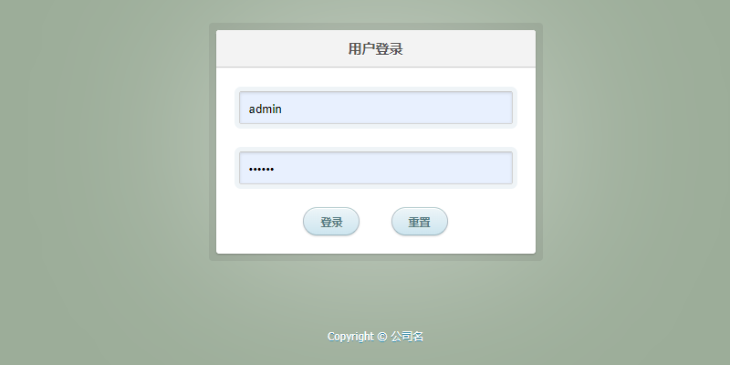

# Spring MVC + Spring + MyBatis

## 代码地址

- Gitee: https://gitee.com/Awaion/tools/tree/master/demo008
- Github: https://github.com/Awaion/tools/tree/master/demo008

## 简介

- 需要依赖 MySQL, Tomcat
- 这是一个古老的项目

## 演示

本地服务启动访问地址：http://localhost:8080/login

## 集成步骤

说明: https://awaion.github.io/01_enterprise/0002_java_ssm.html

## 技术说明

#### 后端

| 技术                 | 说明                | 官网                                           |
| --------------------| ------------------- | ---------------------------------------------- |
| SpringMVC           | MVC框架             | https://spring.io/projects/spring-webflow       |
| Spring4             | DI框架              | https://spring.io/projects/spring-framework      |
| MyBatis3            | ORM框架             | https://mybatis.org/mybatis-3/         |

#### 前端

| 技术         | 说明                   | 官网                                               |
| ----------   | ---------------------  | --------------------------------------            |
| jQuery.js       | 前端框架               | https://jquery.com/                             |

#### 开发工具

| 工具          | 说明                | 官网                                            |
| ------------- | ------------------- | ----------------------------------------------- |
| IDEA          | 开发IDE             | https://www.jetbrains.com/idea/download         |

#### 开发环境

| 工具          | 版本号  | 下载                                                                                 |
| ------------- | ------ | ------------------------------------------------------------                         |
| JDK           | 1.8    | https://www.oracle.com/technetwork/java/javase/downloads/jdk8-downloads-2133151.html |

#### 启动方式

Tomcat服务启动

## 许可证

[MIT License](https://opensource.org/license/mit)

Copyright (c) 2024-2024 Awaion

