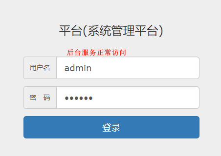
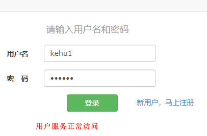

# 模块化 Java Web

## 代码地址

- Gitee: https://gitee.com/Awaion/tools/tree/master/demo010
- Github: https://github.com/Awaion/tools/tree/master/demo010

## 简介

- 需要依赖 MySQL , Tomcat
- 这是一个古老的项目

## 模块化

模块化是软件开发模式的一种,它将一个大型的软件系统划分成多个独立的模块,每个模块完成一个特定的子功能,并且能够与其他模块独立地工作.
模块集成起来可以构成一个整体,完成特定的功能,进而满足用户需求.
模块化的原因是：
- 提高开发效率: 模块化开发可以使得团队成员在不同模块上并行开发,从而提高开发效率.
- 降低项目的风险: 模块化开发可以使得开发人员更加关注模块之间的接口和依赖关系,从而降低项目的风险.
- 提高代码的可读性: 模块化可以使得代码更加结构化,清晰明了,从而提高代码的可读性和可维护性.
- 提高代码的复用性: 模块化可以将代码划分成可重用的部分,降低代码的冗余和重复,提高代码的复用性.
- 简化代码的维护和调试: 当一个软件系统变得越来越复杂时,进行模块化开发可以使得每个模块都相对独立,这样就可以方便地维护和调试每个模
块,而不必考虑整个系统的复杂性.

模块化设计的原则:
- 单一职责原则(SRP):它规定一个模块应该只有一个修改的原因,即一个模块只负责一个功能.这样可以提高模块的内聚性,降低模块之间的耦合度.
- 开放关闭原则(OCP):一个模块或类应该对扩展开放,对修改关闭.也就是说,当需要增加新的功能时,应该通过扩展模块或类的行为,而不是修改已
有的代码.这样可以减少对已有功能的影响,提高系统的可维护性和可扩展性.
- 依赖倒置原则(DIP):在模块之间建立抽象层,上层模块不应该依赖于下层模块的具体实现细节,而应该依赖于抽象.这样可以降低模块之间的耦合
度,提高系统的灵活性和可测试性.
- 接口隔离原则(ISP):一个大而全的接口拆分为多个小而精细的接口,使得每个模块只需要依赖于自己所需要的接口.这样可以降低模块之间的依赖
关系,提高系统的灵活性和可维护性.
- 最小知识原则(迪米特法则)(LKP):模块之间只能依赖于最小的一组接口,即模块只能访问它所需的最少信息.这样可以降低模块之间的耦合度,提高系统的灵活
性和可维护性.

## 演示

本地服务启动访问地址：http://localhost:8080/login.html  

本地服务启动访问地址：http://localhost:8081/login.html  

  

  

## 集成步骤

说明: https://awaion.github.io/01_enterprise/0003_java_modules.html

## 技术说明

#### 后端

| 技术                 | 说明                | 官网                                           |
| --------------------| ------------------- | ---------------------------------------------- |
| SpringMVC           | MVC框架            | https://spring.io/projects/spring-webflow         |
| Spring4             | DI框架              | https://spring.io/projects/spring-framework         |
| MyBatis3            | ORM框架             | https://mybatis.org/mybatis-3/         |

#### 前端

| 技术         | 说明                   | 官网                                               |
| ----------   | ---------------------  | --------------------------------------            |
| jQuery.js       | 前端框架               | https://jquery.com/                             |

#### 开发工具

| 工具          | 说明                | 官网                                            |
| ------------- | ------------------- | ----------------------------------------------- |
| IDEA          | 开发IDE             | https://www.jetbrains.com/idea/download         |

#### 开发环境

| 工具          | 版本号  | 下载                                                                                 |
| ------------- | ------ | ------------------------------------------------------------                         |
| JDK           | 1.8    | https://www.oracle.com/technetwork/java/javase/downloads/jdk8-downloads-2133151.html |

#### 启动方式

Tomcat服务启动

## 许可证

[MIT License](https://opensource.org/license/mit)

Copyright (c) 2024-2024 Awaion

