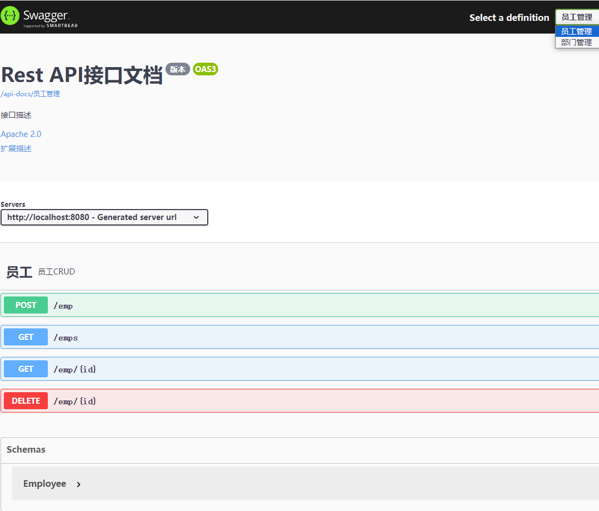

# SpringBoot 3 + OpenAPI 3 + Swagger

## 代码地址

- Gitee: https://gitee.com/Awaion/tools/tree/master/demo018
- Github: https://github.com/Awaion/tools/tree/master/demo018

## 简介

如题

## 演示

http://localhost:8080/swagger-ui/index.html



## 实现

```
<dependency>
    <groupId>org.springdoc</groupId>
    <artifactId>springdoc-openapi-starter-webmvc-ui</artifactId>
    <version>2.1.0</version>
</dependency>

springdoc.api-docs.path=/api-docs
springdoc.swagger-ui.path=/swagger-ui.html
springdoc.show-actuator=true

@Configuration
public class ApiUiConfig {
    @Bean
    public GroupedOpenApi empApi() {
        return GroupedOpenApi.builder()
                .group("员工管理")
                .pathsToMatch("/emp/**", "/emps")
                .build();
    }

    @Bean
    public GroupedOpenApi deptApi() {
        return GroupedOpenApi.builder()
                .group("部门管理")
                .pathsToMatch("/dept/**", "/depts")
                .build();
    }

    @Bean
    public OpenAPI docsOpenAPI() {
        return new OpenAPI()
                .info(new Info()
                        .title("Rest API接口文档")
                        .description("接口描述")
                        .version("版本")
                        .license(new License().name("Apache 2.0").url("http://springdoc.org")))
                .externalDocs(new ExternalDocumentation()
                        .description("扩展描述")
                        .url("https://springshop.wiki.github.org/docs"));
    }
}

@Tag(name = "部门", description = "部门的CRUD")
@RestController
public class DeptController {
    @Autowired
    DeptService deptService;

    @Operation(summary = "查询", description = "按照id查询部门")
    @GetMapping("/dept/{id}")
    public Dept getDept(@PathVariable("id") Long id) {
        return deptService.getDeptById(id);
    }
```

## 技术说明

#### 后端

| 技术           | 说明                | 官网                                           |
|--------------| ------------------- | ---------------------------------------------- |
| SpringBoot 3 | SpringBoot     | https://spring.io/projects/spring-boot         |
| Spring Doc   | Spring Doc     | https://springdoc.org/         |

#### 开发工具

| 工具          | 说明                | 官网                                            |
| ------------- | ------------------- | ----------------------------------------------- |
| IDEA          | 开发IDE             | https://www.jetbrains.com/idea/download         |

#### 开发环境

| 工具     | 版本号  | 下载                                                                                 |
|--------| ------ | ------------------------------------------------------------                         |
| JDK  | 17  | https://www.oracle.com/java/technologies/downloads/#java17 |

#### 启动方式

http://localhost:8080/swagger-ui/index.html

## 许可证

[MIT License](https://opensource.org/license/mit)

Copyright (c) 2024-2024 Awaion

