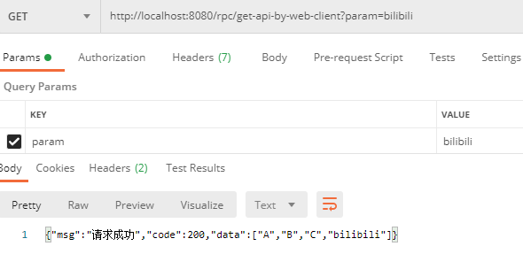

# SpringBoot 3 + Spring Web Flow 远程调用

## 代码地址

- Gitee: https://gitee.com/Awaion/tools/tree/master/demo019
- Github: https://github.com/Awaion/tools/tree/master/demo019

## 简介

如题

## 演示

http://localhost:8080/rpc/get-api?param=bilibili

http://localhost:8080/rpc/post-api

http://localhost:8080/rpc/get-api-by-web-client?param=bilibili




## 实现

```
<dependency>
    <groupId>org.springframework.boot</groupId>
    <artifactId>spring-boot-starter-webflux</artifactId>
</dependency>

@Bean
HttpServiceProxyFactory httpServiceProxyFactory(@Value("${api.token}") String token) {
    WebClient client = WebClient.builder()
            .defaultHeader("Authorization", token)
            .codecs(clientCodecConfigurer
                    -> clientCodecConfigurer
                    .defaultCodecs()
                    .maxInMemorySize(256 * 1024 * 1024))
            .build();
    return HttpServiceProxyFactory.builder(WebClientAdapter.forClient(client)).build();
}

@Bean
RpcDemo019Interface rpcDemo019Interface(HttpServiceProxyFactory httpServiceProxyFactory) {
    return httpServiceProxyFactory.createClient(RpcDemo019Interface.class);
}

@HttpExchange(url = "http://localhost:8080")
public interface RpcDemo019Interface {
    @GetExchange(url = "/get-api", accept = "application/json")
    Mono<String> getApi(@RequestParam("param") String param);

    @PostExchange(url = "/post-api", accept = "application/json")
    Mono<String> postApi(@RequestBody Map<String, Object> body);
}

@Autowired
private RpcDemo019Interface rpcDemo019Interface;

public Mono<String> getApi(String param) {
    return rpcDemo019Interface.getApi(param);
}

public Mono<String> postApi(Map<String, Object> body) {
    return rpcDemo019Interface.postApi(body);
}

public Mono<String> getByWebClient(String param) {
    WebClient client = WebClient.create();
    Map<String, String> params = new HashMap<>();
    params.put("param", param);
    return client.get()
            .uri("http://localhost:8080/get-api?param={param}", params)
            .accept(MediaType.APPLICATION_JSON)
            .header("Authorization", "qazwsx")
            .retrieve()
            .bodyToMono(String.class);
}
```

## 技术说明

#### 后端

| 技术           | 说明                | 官网                                           |
|--------------| ------------------- | ---------------------------------------------- |
| SpringBoot 3 | SpringBoot     | https://spring.io/projects/spring-boot         |
| Spring Web Flow   | Spring Web Flow     | https://spring.io/projects/spring-webflow         |

#### 开发工具

| 工具          | 说明                | 官网                                            |
| ------------- | ------------------- | ----------------------------------------------- |
| IDEA          | 开发IDE             | https://www.jetbrains.com/idea/download         |

#### 开发环境

| 工具     | 版本号  | 下载                                                                                 |
|--------| ------ | ------------------------------------------------------------                         |
| JDK  | 17  | https://www.oracle.com/java/technologies/downloads/#java17 |

#### 启动方式

http://localhost:8080/rpc/get-api?param=bilibili

http://localhost:8080/rpc/post-api

http://localhost:8080/rpc/get-api-by-web-client?param=bilibili

## 许可证

[MIT License](https://opensource.org/license/mit)

Copyright (c) 2024-2024 Awaion

