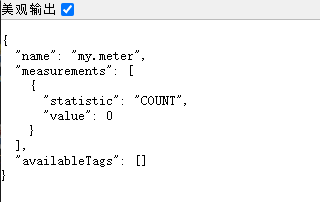
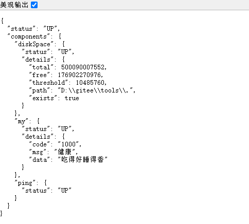
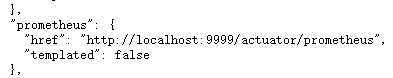
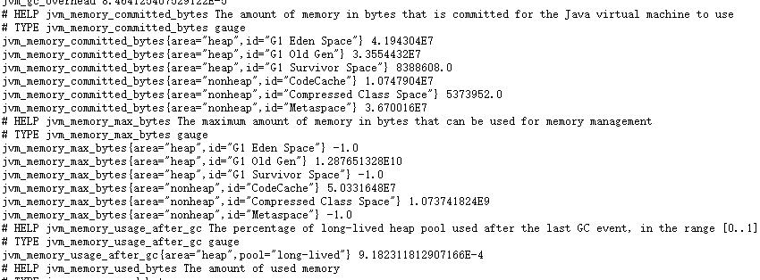

# SpringBoot 3 + Actuator + Prometheus

## 代码地址

- Gitee: https://gitee.com/Awaion/tools/tree/master/demo021
- Github: https://github.com/Awaion/tools/tree/master/demo021

## 简介

如题

## 演示

http://localhost:9999/actuator/metrics/my.meter

http://localhost:9999/actuator/health

http://localhost:9999/actuator

http://localhost:9999/actuator/prometheus









## 实现

```text
<dependency>
    <groupId>org.springframework.boot</groupId>
    <artifactId>spring-boot-starter-actuator</artifactId>
</dependency>
<dependency>
    <groupId>org.springframework.boot</groupId>
    <artifactId>spring-boot-starter-web</artifactId>
</dependency>

<dependency>
    <groupId>io.micrometer</groupId>
    <artifactId>micrometer-registry-prometheus</artifactId>
    <scope>runtime</scope>
</dependency>

management.endpoints.web.exposure.include=*
management.endpoint.health.enabled=true
management.endpoint.health.show-details=always

@Component
public class MyMeterComponent {
    Counter counter = null;

    public MyMeterComponent(MeterRegistry meterRegistry) {
        // metrics 节点 新增监控信息
        counter = meterRegistry.counter("my.meter");
    }

    public void myMeterCounter() {
        // 监控信息业务处理
        counter.increment();
    }
}

@Component
public class MyHealthIndicator extends AbstractHealthIndicator {

    @Override
    protected void doHealthCheck(Health.Builder builder) throws Exception {
        // health 节点 新增监控信息
        int check = myHealthCheck();
        if (check == 1) {
            builder.up()
                    .withDetail("code", "1000")
                    .withDetail("msg", "健康")
                    .withDetail("data", "吃得好睡得香")
                    .build();
        } else {
            builder.down()
                    .withDetail("code", "1001")
                    .withDetail("msg", "不健康")
                    .withDetail("data", "吃不好睡不香")
                    .build();
        }

    }

    public int myHealthCheck() {
        // 监控信息业务处理
        return 1;
    }
}
```

## 技术说明

#### 后端

| 技术           | 说明                | 官网                                           |
|--------------| ------------------- | ---------------------------------------------- |
| SpringBoot 3 | SpringBoot     | https://spring.io/projects/spring-boot         |
| SpringBoot Actuator | SpringBoot Actuator     | https://spring.io/projects/spring-boot         |
| Prometheus | Prometheus     | https://prometheus.io/         |

#### 开发工具

| 工具          | 说明                | 官网                                            |
| ------------- | ------------------- | ----------------------------------------------- |
| IDEA          | 开发IDE             | https://www.jetbrains.com/idea/download         |

#### 开发环境

| 工具     | 版本号  | 下载                                                                                 |
|--------| ------ | ------------------------------------------------------------                         |
| JDK  | 17  | https://www.oracle.com/java/technologies/downloads/#java17 |

#### 启动方式

http://localhost:9999/actuator/metrics/my.meter

http://localhost:9999/actuator/health

http://localhost:9999/actuator

http://localhost:9999/actuator/prometheus

## 许可证

[MIT License](https://opensource.org/license/mit)

Copyright (c) 2024-2024 Awaion

