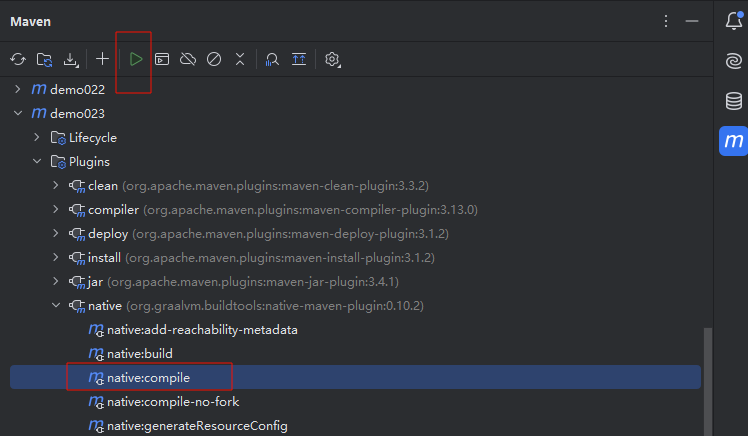
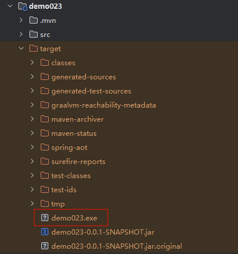
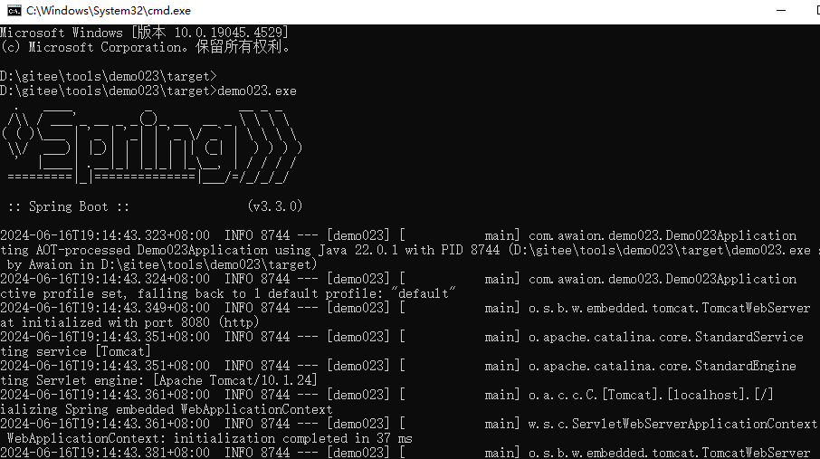

# SpringBoot 3 + GraalVM

## 代码地址

- Gitee: https://gitee.com/Awaion/tools/tree/master/demo023
- Github: https://github.com/Awaion/tools/tree/master/demo023

## 简介

GraalVM 是一个高性能的JDK,旨在加速用 Java 和其他 JVM 语言编写的应用程序的执行,同时还提供JavaScript,Python和许多其他流行语言的运行时.

使用 GraalVM 编译成的原生应用已经是机器码了,无需再依赖 JDK 环境运行.

## 演示







## 实现

```text
<plugin>
    <groupId>org.graalvm.buildtools</groupId>
    <artifactId>native-maven-plugin</artifactId>
</plugin>
```

## 技术说明

#### 后端

| 技术           | 说明                | 官网                                           |
|--------------| ------------------- | ---------------------------------------------- |
| SpringBoot 3 | SpringBoot     | https://spring.io/projects/spring-boot         |
| GraalVM | GraalVM     | https://www.graalvm.org         |

#### 开发工具

| 工具          | 说明                | 官网                                            |
| ------------- | ------------------- | ----------------------------------------------- |
| IDEA          | 开发IDE             | https://www.jetbrains.com/idea/download         |

#### 开发环境

| 工具     | 版本号  | 下载                                                                                 |
|--------| ------ | ------------------------------------------------------------                         |
| JDK  | 17  | https://www.oracle.com/java/technologies/downloads/#java17 |

#### 启动方式

demo023.exe

## 许可证

[MIT License](https://opensource.org/license/mit)

Copyright (c) 2024-2024 Awaion

