# 分布式系统

## 技术框架版本适配

- Java 17+
- Maven 3.9+
- MySQL 8.0+
- SpringBoot 3.2.0
- SpringCloud 2023.0.0
- SpringCloud Alibaba 2023.0.1.0

## 文档和源码

- https://spring.io/projects/spring-boot
- https://github.com/spring-projects/spring-boot
- https://github.com/spring-projects/spring-boot/releases/
- https://github.com/spring-projects/spring-boot/wiki
- https://stackoverflow.com/questions/tagged/spring-boot
- https://github.com/spring-cloud
- https://spring.io/projects/spring-cloud
- https://stackoverflow.com/questions/tagged/spring-cloud
- https://spring.io/projects/spring-cloud-alibaba
- https://github.com/alibaba/spring-cloud-alibaba/
- https://sca.aliyun.com/

## SpringBoot 特性

- 创建独立的 Spring 应用程序
- 直接嵌入Tomcat,Jetty,Undertow(无需外部服务器部署WAR文件)
- 提供 starter 依赖以简化构建配置
- 尽可能自动配置Spring和第三方库
- 提供指标,运行状况检查和外部化配置等生产就绪功能
- 绝对没有代码生成,也不需要XML配置

企业实践: 
- 自定义 parent 工程,继承 spring-boot-parent,所有项目使用自定义 parent,统一管理技术框架版本,减少处理框架版本兼容性问题.
- 自定义 starter 工程,统一引入公共组件,实现公共业务逻辑,减少重复业务代码,统一规范以及方便扩展.

## SpringCloud 特性

- 分布式/版本化配置
- 服务注册和发现
- 路由网关
- 服务间调用
- 负载平衡
- 断路器
- 分布式消息传递
- 短期微服务(任务)
- 消费者驱动和生产者驱动的合同测试

企业实践:
- 自定义 dependencies 工程,继承 spring-cloud-dependencies,所有项目使用自定义 dependencies,统一管理分布式技术框架版本,减少处理框架版本兼容性问题.
- 自定义 cloud-starter 工程,统一引入公共分布式组件,实现公共分布式业务逻辑,减少重复业务代码,统一规范以及方便扩展.

## IDE统一环境

统一环境主要是避免因开发环境问题,导致项目跑不起来,代码出错.常见的环境问题有:编码,代码格式化,智能提醒,编译环境

以 IDEA2024 为例
- 编码 Settings -> File Encodings -> UTF-8 * 3 -> Transparent native-to-ascii conversion
- 注解处理 Settings -> Annotation Processors -> Enable annotation processing
- 编译环境 Settings -> Java Compiler -> 17


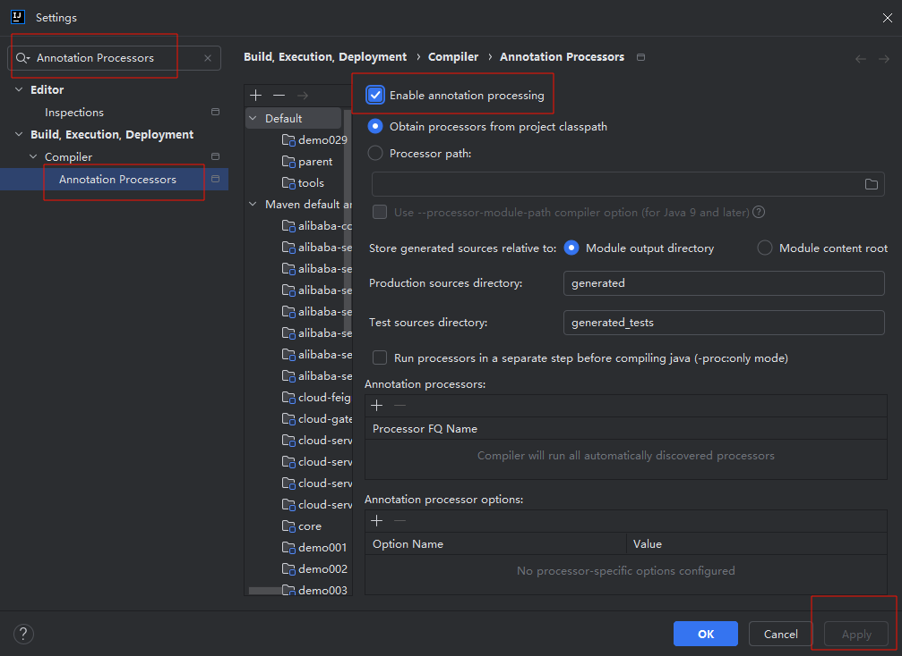

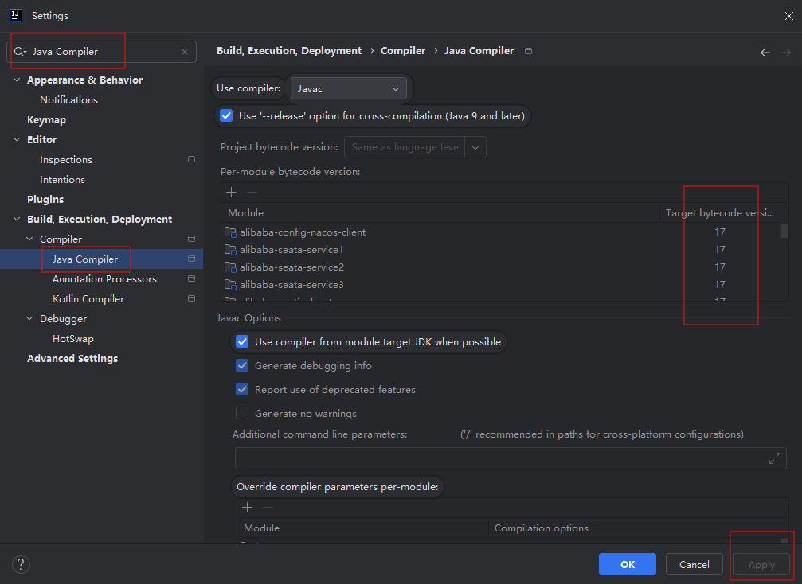

## 代码统一规范

为使代码具有可读性,易于运行,需要定义规范,通过简单的阅读文件,快速入门运行项目.
- README文件,说明编译环境,依赖组件,依赖服务,运行方式等.按照此文件即可运行项目.
- 只提交代码,不提交环境配置
- 写注释以及标注需求链接

## 统一外部服务组件

提供统一版本的外部服务组件,且配置相应使用文档,例如:Redis,MySQL,Kafka,Postman,JMeter

## 代码生成和MyBatis

通常,普通的CRUD操作具有相同的逻辑,使用通用模版即可实现,所以需要使用代码生成技术

MyBatis Generator: https://mybatis.org/generator/ & https://github.com/mybatis/generator

MyBatis-Plus(国产16K)(商业化趋势): https://baomidou.com/ & https://github.com/baomidou/mybatis-plus

MyBatis 通用 Mapper4(国产7k)(纯开源): https://github.com/abel533/Mapper

Maven -> Plugins -> mybatis-generator:generate -> Run

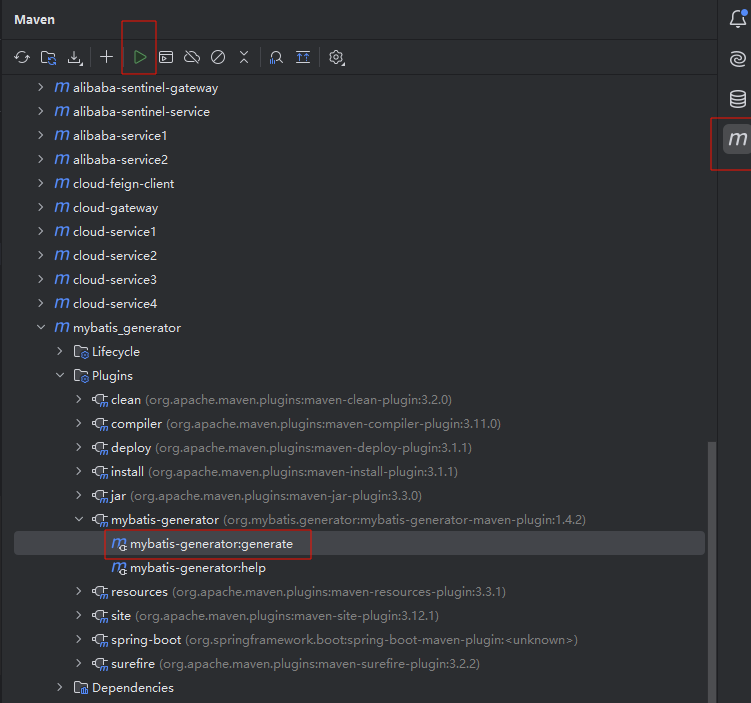

## 服务注册和发现及配置 Consul

特性
- 服务注册及发现机制,统一管理微服务
- 给 Spring Cloud 提供负载均衡
- 给 Spring Cloud Gateway 提供动态路由和过滤器
- 提供分布式配置,键值对(KV)存储方式
- 提供控制总线(Bus),实现分布式控制事件
- 自带可视化WebUI
- Go语言开发
- 社区版(community)免费使用,企业版收费

工作流程
- 服务注册 Register
- 服务查询 Query
- 服务通信安全加密 Secure

其它特性
- 使用 Raft 分布式一致性协议


服务端安装

```text
# window 查看系统架构
echo %PROCESSOR_ARCHITECTURE%

# window 查看端口使用
netstat -ano

# 查看版本
consul --version

# 开发模式启动,配置不会持久化
consul agent -dev

# 默认地址访问
http://localhost:8500

# 配置持久化方式启动,管理员权限
consul_start.bat
```

更多

- https://www.consul.io/
- https://developer.hashicorp.com/consul
- https://developer.hashicorp.com/consul/docs/intro
- https://developer.hashicorp.com/consul/docs/install/performance
- https://spring.io/projects/spring-cloud-consul
- https://www.hashicorp.com/terms-of-evaluation
- https://github.com/hashicorp/consul
- https://github.com/spring-cloud/spring-cloud-consul
- https://github.com/Netflix/eureka/wiki

## 微服务1

cloud-service1 依赖服务 consult,zipkin,mysql
- 测试从 Consul 中拉取配置
- 提供被 Feign 调用的接口
- 提供被 Gateway 调用的接口
- 测试 Micrometer(Sleuth) 调用链路
- 提供 MySQL CRUD
- 提供 Resilience4j(Circuit Breaker) 测试接口

更多

- https://docs.spring.io/spring-cloud-consul/reference/appendix.html
- https://spring.io/projects/spring-cloud-sleuth
- https://micrometer.io/docs/tracing
- https://github.com/mybatis/spring-boot-starter
- https://spring.io/projects/spring-cloud-commons

## 微服务2

cloud-service3 依赖服务 consul
- 使用 RestTemplate + LoadBalanced 做微服务之间的调用

更多

- https://docs.spring.io/spring-framework/docs/6.0.11/javadoc-api/org/springframework/web/client/RestTemplate.html
- https://docs.spring.io/spring-cloud-consul/reference/appendix.html
- https://spring.io/projects/spring-cloud-sleuth
- https://micrometer.io/docs/tracing

## 微服务3

cloud-service3 依赖服务 consul
- 使用 OpenFeign 做微服务之间的调用
- 使用 Circuit Breaker 作为接口断路器,实现框架为 Resilience4J

更多

- https://spring.io/projects/spring-cloud-openfeign
- https://spring.io/projects/spring-cloud-circuitbreaker
- https://github.com/resilience4j/resilience4j
- https://docs.spring.io/spring-cloud-consul/reference/appendix.html
- https://spring.io/projects/spring-cloud-sleuth
- https://micrometer.io/docs/tracing

## 负载均衡 LoadBalancer

LoadBalancer客户端负载均衡,在调用微服务接口时候,会在注册中心上获取注册信息服务列表之后缓存到JVM本地,从而在本地实现RPC远程服务调用技术.

LoadBalancer 在工作时分成两步:
1. 先选择ConsulServer从服务端查询并拉取服务列表,默认轮询调用谁都可以正常执行
2. 按照指定的负载均衡策略从server取到的服务注册列表中由客户端自己选择一个地址,所以LoadBalancer是一个客户端的负载均衡器

核心类
- 自动配置类 LoadBalancerAutoConfiguration common依赖
- 接口类 ReactorServiceInstanceLoadBalancer common依赖
- 轮询(默认)算法实现类 RoundRobinLoadBalancer loadbalancer依赖
- 随机算法实现类 RandomLoadBalancer loadbalancer依赖
- Nacos自定义实现类 NacosLoadBalancer

最新(4.1.3)支持的客户端 Spring RestTemplate ,Spring RestClient ,Spring WebClient ,Spring WebFlux WebClient

Nginx是服务器负载均衡,客户端所有请求都会交给Nginx,然后由nginx实现转发请求,即负载均衡是由服务端实现的


其它

- https://docs.spring.io/spring-framework/docs/6.0.11/javadoc-api/org/springframework/web/client/RestTemplate.html
- https://spring.io/projects/spring-cloud-commons
- https://docs.spring.io/spring-cloud-commons/reference/spring-cloud-commons/loadbalancer.html

## 声明式Rest客户端 OpenFeign

- 可插拔的注解支持,包括Feign注解和JAX-RS注解
- 支持可插拔的HTTP编码器和解码器
- 支持Sentinel和它的Fallback
- 支持SpringCloudLoadBalancer的负载均衡
- 支持HTTP请求和响应的压缩
- 超时控制
- 重试机制
- 变更 HttpClient 实现
- 日志打印
- 支持 OkHttpClient 和 Apache HttpClient 5,默认是 java.net.HttpURLConnection,没有池化
- 支撑 Spring Cloud CircuitBreaker 熔断降级限流

核心类
- 启用注解 @EnableFeignClients
- 客户端注解 @FeignClient
- 注册登记类 FeignClientsRegistrar
- 编码/解码 Encoder/Decoder
- 日志 Logger
- 链路追踪类 MicrometerObservationCapability
- 校验解析类 Contract
- 重试类 Retryer

更多

- https://docs.spring.io/spring-cloud-openfeign/reference/spring-cloud-openfeign.html
- https://spring.io/projects/spring-cloud-openfeign
- https://github.com/spring-cloud/spring-cloud-openfeign
- https://stackoverflow.com/questions/tagged/spring-cloud

## 断路器 Circuit Breaker

断口器抽象(接口)API,支持的实现 Resilience4J,Spring Retry

核心类

- 工厂类 CircuitBreakerFactory

Resilience4J

专为函数式编程而设计的轻量级容错库,提供高阶函数(装饰器),以增强任何功能接口,lambda 表达式或方法引用.包括断路器,限流,重试或舱壁隔离.

特性
- 断路器(熔断,重试,回退)
- 限流
- 舱壁隔离

状态

断路器通过有限状态机实现,该状态机具有三种正常状态:CLOSED,OPEN,HALF_OPEN 以及两种特殊状态 DISABLED,FORCED_OPEN

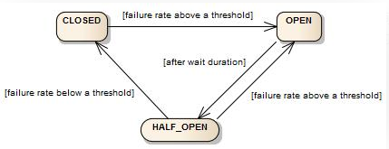

熔断指标

- 计数滑动窗口 Count-based sliding window 通过 N 个测量值的圆形阵列实现
- 时间滑动窗口 Time-based sliding window 通过 N 个部分聚合(桶)的循环数组实现
  
舱壁隔离

用于隔离故障,防止故障或性能问题从一个部分传播到系统的其他部分,实现方式有两种
1. 使用信号量 SemaphoreBulkhead
2. 使用有界队列和固定线程池 FixedThreadPoolBulkhead

限流

默认实现是 AtomicRateLimiter,可以切换成 SemaphoreBasedRateLimiter

常见限流算法

- 漏斗算法(LeakyBucket) 匀速处理,效率低
- 令牌桶算法(TokenBucket) 类似于响应式编程buffer区
- 滚动时间窗口(Tumbling Time Window) 流量0~2倍间波动,幅度大
- 滑动时间窗口(Sliding Time Window) 滚动时间窗口的优化,波动幅度小

更多

- https://spring.io/projects/spring-cloud-circuitbreaker
- https://github.com/resilience4j/resilience4j
- https://resilience4j.readme.io/docs/getting-started

## 分布式链路追踪 Sleuth(Micrometer) + ZipKin

作用

- 实时观测系统的整体调用链路情况,快速发现并定位到问题
- 判断故障对系统的影响范围与影响程度
- 梳理出服务之间的依赖关系,并判断出服务之间的依赖关系是否合理
- 助力分析整个系统调用链路的性能与瓶颈点
- 助力分析系统的存储瓶颈与容量规划

原理

- 检测来自 Spring 应用程序的常见入口和出口点(servlet filter, rest template, scheduled actions, message channels, feign client)
- 将跟踪和跨度 ID 添加到 Slf4J MDC,从日志聚合器中的给定跟踪或跨度中提取所有日志
- 一条链路追踪在每个服务调用的时候加上Trace ID(唯一标识) 和 Span ID(一次请求信息),Span 通过parent id 关联
- 通过 HTTP 生成并报告与 Zipkin 兼容的跟踪


zipkin 使用

```text
# 启动
java -jar zipkin-server-3.0.0-rc0-exec.jar
# 访问
http://127.0.0.1:9411/
```


更多

- https://spring.io/projects/spring-cloud-sleuth
- https://micrometer.io/docs/tracing
- https://zipkin.io/

## 网关 Gateway

特性

- 路由匹配
- 鉴权
- 限流
- 熔断
- 日志监控
- 修改请求响应信息

核心概念

- Route 路由,网关的基础构建
- Predicate 断言,匹配HTTP请求中的任何内容,例如标头或参数
- Filter 过滤,修改请求和响应

核心类

- 路由断言处理类 RoutePredicateHandlerMapping
- 过滤器链处理类 FilteringWebHandler
- 过滤器工厂 AbstractGatewayFilterFactory
- 路由断言工厂 AbstractRoutePredicateFactory
- 全局过滤类 GlobalFilter
- 网关配置类 GatewayProperties
- 路径发现类 DiscoveryLocatorProperties
- 服务发现自动配置类 GatewayDiscoveryClientAutoConfiguration

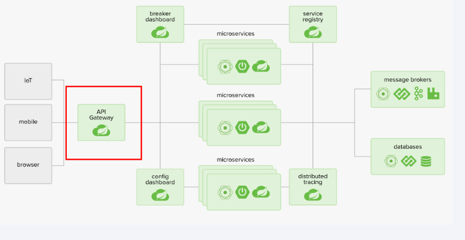


更多

- https://spring.io/projects/spring-cloud-gateway
- https://github.com/spring-cloud/spring-cloud-gateway
- https://docs.spring.io/spring-cloud-gateway/reference/spring-cloud-gateway/developer-guide.html
- https://docs.spring.io/spring-cloud-gateway/reference/appendix.html

## Spring Cloud Alibaba

主要功能

- 服务限流降级:默认支持 WebServlet,WebFlux,OpenFeign,RestTemplate,Spring Cloud Gateway,Dubbo 和 RocketMQ 限流降级功能的接入,
可以在运行时通过控制台实时修改限流降级规则,还支持查看限流降级 Metrics 监控.
- 服务注册与发现:适配 Spring Cloud 服务注册与发现标准,默认集成对应 Spring Cloud 版本所支持的负载均衡组件的适配.
- 分布式配置管理:支持分布式系统中的外部化配置,配置更改时自动刷新.
- 消息驱动能力:基于 Spring Cloud Stream 为微服务应用构建消息驱动能力.
- 分布式事务:使用 @GlobalTransactional 注解, 高效并且对业务零侵入地解决分布式事务问题.
- 阿里云对象存储:阿里云提供的海量,安全,低成本,高可靠的云存储服务.支持在任何应用,任何时间,任何地点存储和访问任意类型的数据.
- 分布式任务调度:提供秒级,精准,高可靠,高可用的定时(基于 Cron 表达式)任务调度服务.同时提供分布式的任务执行模型,如网格任务.网格任务支持海
量子任务均匀分配到所有 Worker(schedulerx-client)上执行.
- 阿里云短信服务:覆盖全球的短信服务,友好,高效,智能的互联化通讯能力,帮助企业迅速搭建客户触达通道.

组件

- Sentinel:把流量作为切入点,从流量控制,熔断降级,系统负载保护等多个维度保护服务的稳定性.
- Nacos:一个更易于构建云原生应用的动态服务发现,配置管理和服务管理平台.
- RocketMQ:一款开源的分布式消息系统,基于高可用分布式集群技术,提供低延时的,高可靠的消息发布与订阅服务.
- Seata:阿里巴巴开源产品,一个易于使用的高性能微服务分布式事务解决方案.
- Alibaba Cloud OSS: 阿里云对象存储服务(Object Storage Service,简称 OSS),是阿里云提供的海量,安全,低成本,高可靠的云存储服务.您可以
在任何应用,任何时间,任何地点存储和访问任意类型的数据.
- Alibaba Cloud SchedulerX: 阿里中间件团队开发的一款分布式任务调度产品,提供秒级,精准,高可靠,高可用的定时(基于 Cron 表达式)任务调度服务.
- Alibaba Cloud SMS: 覆盖全球的短信服务,友好,高效,智能的互联化通讯能力,帮助企业迅速搭建客户触达通道.

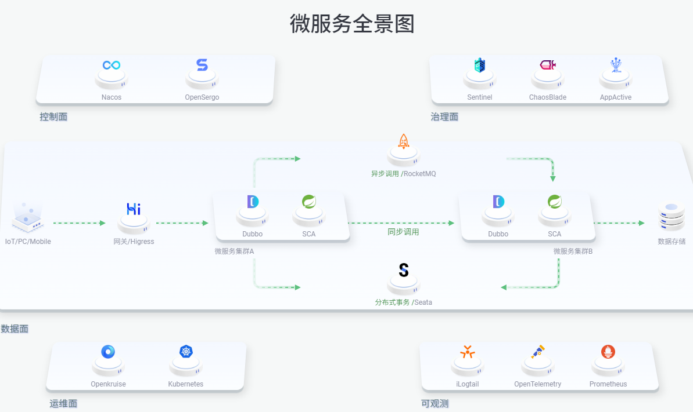

更多

- https://spring.io/projects/spring-cloud-alibaba
- https://github.com/alibaba/spring-cloud-alibaba
- https://sca.aliyun.com/

## 注册配置中心 Nacos

Nacos 是 Dynamic Naming and Configuration Service 的首字母简称,一个更易于构建云原生应用的动态服务发现,配置管理和服务管理平台

特性

- 服务发现和服务健康监测
- 动态配置服务
- 动态 DNS 服务
- 服务及其元数据管理

概念

- 服务注册中心 (Service Registry)
- 服务元数据 (Service Metadata)
- 服务提供方 (Service Provider)
- 服务消费方 (Service Consumer)
- 名字服务 (Naming Service)
- 配置服务 (Configuration Service)

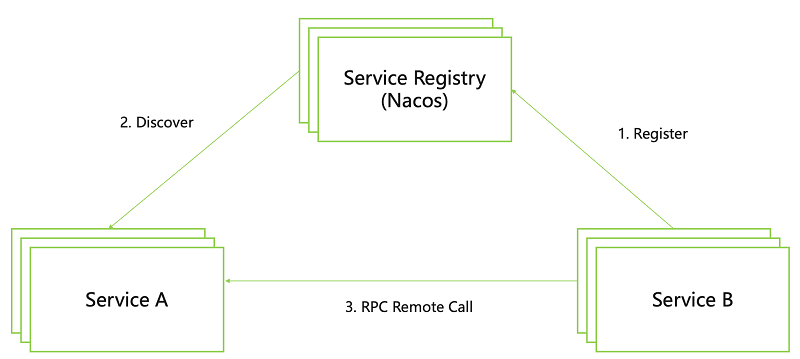

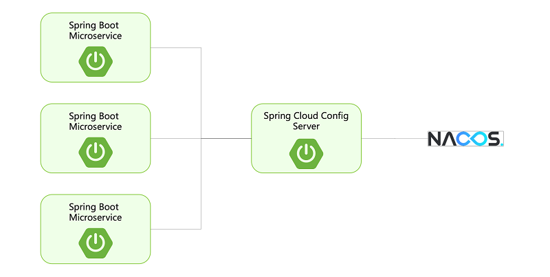


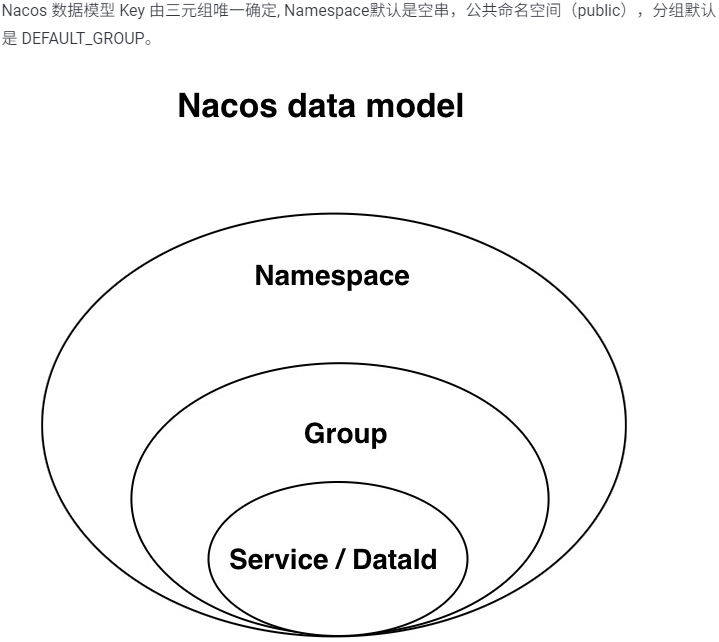

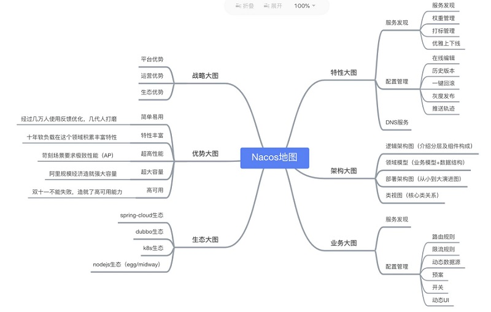

服务端启动

```text
# 启动
bin/startup.cmd -m standalone

# 默认地址访问,默认账户/密码:nacos/nacos
http:localhost:8848/nacos
```

更多

- https://sca.aliyun.com/docs/2023/user-guide/nacos/quick-start
- https://nacos.io/zh-cn/docs/quick-start.html
- https://github.com/alibaba/nacos/releases

## 限流降级 Sentinel

Sentinel 是面向分布式,多语言异构化服务架构的流量治理组件,主要以流量为切入点,从流量路由,流量控制,流量整形,熔断降级,系统自适应过载保护,热点流量防
护等多个维度来帮助开发者保障微服务的稳定性

特征

- 丰富的应用场景:Sentinel 承接了阿里巴巴近 10 年的双十一大促流量的核心场景,例如秒杀(即突发流量控制在系统容量可以承受的范围),消息削峰填谷,实时熔断下游不可用应用等.
- 完备的实时监控:Sentinel 同时提供实时的监控功能.您可以在控制台中看到接入应用的单台机器秒级数据，甚至 500 台以下规模的集群的汇总运行情况.
- 广泛的开源生态:Sentinel 提供开箱即用的与其它开源框架/库的整合模块，例如与 Spring Cloud,Dubbo,gRPC 的整合.您只需要引入相应的依赖并进行简单的配置即可快速地接入 Sentinel.
- 完善的 SPI 扩展点:Sentinel 提供简单易用,完善的 SPI 扩展点.您可以通过实现扩展点，快速的定制逻辑.例如定制规则管理,适配数据源等.

原理

- Slot(变量槽)是局部变量表中最基本的存储单元
- 插槽链 slot chain(NodeSelectorSlot,ClusterBuilderSlot,StatisticSlot,FlowSlot,AuthoritySlot,DegradeSlot,SystemSlot)
- ProcessorSlot 作为 SPI 接口进行扩展

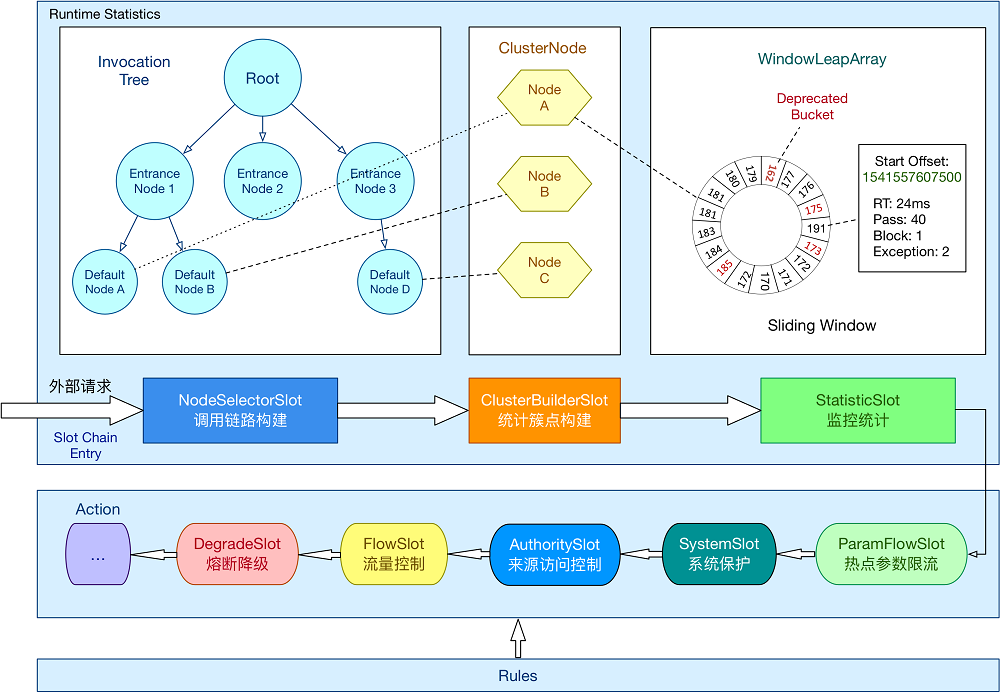

服务端启动

```text
# 启动
java -jar sentinel-dashboard-1.8.6.jar
# 登录 sentinel/sentinel
http://localhost:8080/ 
```

关联词汇:服务雪崩,服务降级,服务熔断,服务限流,服务隔离,服务超时

更多

- https://sca.aliyun.com/
- https://github.com/alibaba/Sentinel
- https://sentinelguard.io/zh-cn/docs/introduction.html

## 网关限流 Gateway + Sentinel

原理

- GatewayFlowRule:网关限流规则,针对 API Gateway 的场景定制的限流规则,可以针对不同 route 或自定义的 API 分组进行限流,支持针对请求中的参数,Header,来源 IP 等进行定制化的限流.
- ApiDefinition：用户自定义的 API 定义分组,可以看做是一些 URL 匹配的组合.比如我们可以定义一个 API 叫 my_api,请求 path 模式为 /foo/** 和 /baz/** 的都归到 my_api 
这个 API 分组下面.限流的时候可以针对这个自定义的 API 分组维度进行限流.
- GatewayRuleManager.loadRules(rules) 手动加载网关规则
- GatewayRuleManager.register2Property(property) 注册动态规则源动态推送(推荐方式)
- Sentinel 1.6.3 引入了网关流控控制台的支持,用户可以直接在 Sentinel 控制台上查看 API Gateway 实时的 route 和自定义 API 分组监控,管理网关规则和 API 分组配置.

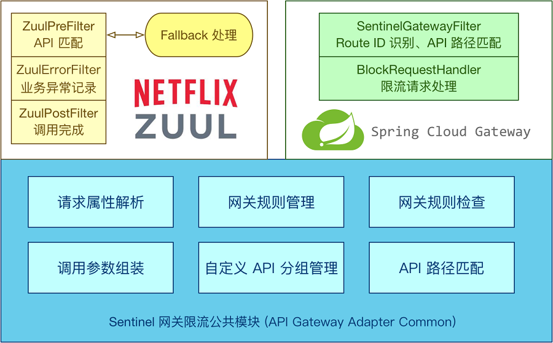

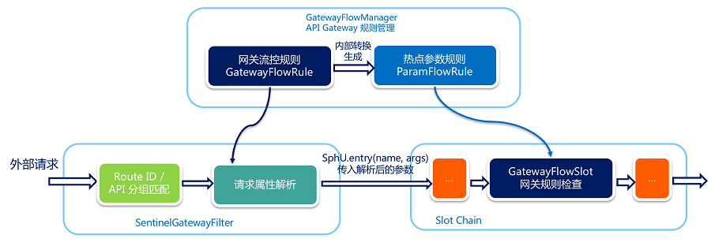

更多

- https://sentinelguard.io/zh-cn/docs/api-gateway-flow-control.html
- https://github.com/alibaba/Sentinel/wiki/%E7%BD%91%E5%85%B3%E9%99%90%E6%B5%81
- https://github.com/alibaba/Sentinel/tree/master/sentinel-demo/sentinel-demo-spring-cloud-gateway
- https://sentinelguard.io/zh-cn/index.html
- https://github.com/alibaba/Sentinel

## 分布式事务 Seata

Seata(Simple Extensible Autonomous Transaction Architecture)是一款开源的分布式事务解决方案,致力于提供高性能和简单易用的分布式事务服务.
Seata 提供AT,TCC,SAGA,XA事务模式,为用户打造一站式的分布式解决方案.

- TC(Transaction Coordinator)事务协调器
- TM(Transaction Manager)事务管理器
- RM(ResourceManager)资源管理器

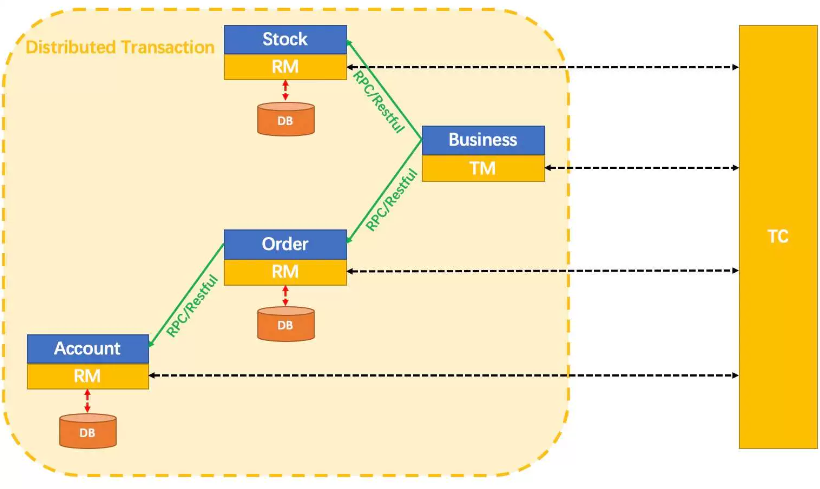

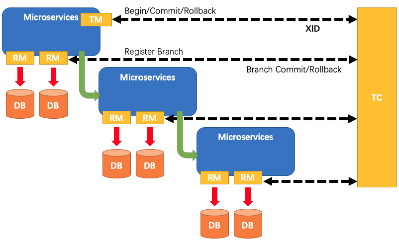

AT 模式基于 支持本地 ACID 事务 的 关系型数据库,先获取全局锁+本地消息表

- 一阶段 prepare 行为：在本地事务中，一并提交业务数据更新和相应回滚日志记录。
- 二阶段 commit 行为：马上成功结束，自动 异步批量清理回滚日志。
- 二阶段 rollback 行为：通过回滚日志，自动 生成补偿操作，完成数据回滚。

TCC 模式，不依赖于底层数据资源的事务支持：

- 一阶段 prepare 行为：调用 自定义 的 prepare 逻辑。
- 二阶段 commit 行为：调用 自定义 的 commit 逻辑。
- 二阶段 rollback 行为：调用 自定义 的 rollback 逻辑。

Saga模式是SEATA提供的长事务解决方案,基于状态机引擎来实现的

- 业务流程中每个参与者都提交本地事务，
- 当出现某一个参与者失败则补偿前面已经成功的参与者，一阶段正向服务和二阶段补偿服务都由业务开发实现
- 优势:一阶段提交本地事务，无锁，高性能
- 优势:事件驱动架构，参与者可异步执行，高吞吐
- 优势:补偿服务易于实现
- 缺点:不保证隔离性

XA 规范 是 X/Open 组织定义的分布式事务处理（DTP，Distributed Transaction Processing）标准

- XA 协议要求事务资源本身提供对规范和协议的支持，所以事务资源（如数据库）可以保障从任意视角对数据的访问有效隔离，满足全局数据一致性
- 基于两阶段提交,数据库自身实现
- 业务无侵入
- XA prepare 后，分支事务进入阻塞阶段，收到 XA commit 或 XA rollback 前必须阻塞等待。事务资源长时间得不到释放，锁定周期长，而且在应用层上面无法干预，性能差。

服务端启动

```text
# 启动脚本
bin\seata-server.bat
# 访问地址 seata/seata
http://localhost:7091
```

更多

- https://github.com/alibaba/spring-cloud-alibaba/blob/2023.x/spring-cloud-alibaba-examples/seata-example/readme-zh.md
- https://sca.aliyun.com/docs/2023/user-guide/seata/overview/
- https://seata.apache.org/zh-cn/docs/user/mode/at/
- https://github.com/apache/incubator-seata/releases
- https://github.com/apache/incubator-seata
- https://seata.apache.org/