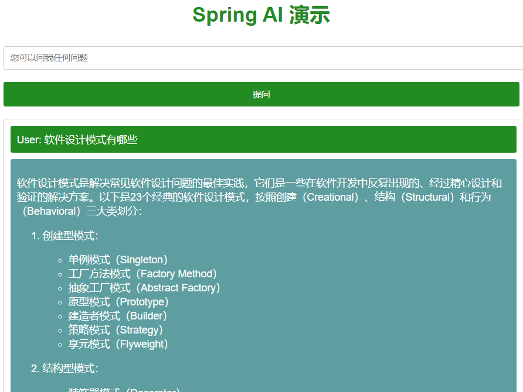

# Spring AI

## 代码地址

- Gitee: https://gitee.com/Awaion/tools/tree/master/demo032
- Github: https://github.com/Awaion/tools/tree/master/demo032

## 简介

Spring AI 最初专注于设计用于处理语言输入和生成语言输出的模型。 该项目背后的想法是为开发人员提供一个抽象接口，这是将生成式
AI API 作为独立组件添
加到应用程序中的基础。 其中一种抽象是接口 AiClient，它有两个基本实现 - OpenAI 和 Azure OpenAI。

Spring AI 的核心是提供抽象，作为开发 Java AI 应用程序的基础，提供以下功能：

- 提供多种大模型服务对接能力，包括业界大多数主流大模型服务等；
- 支持灵活的 Prompt Template 和模型输出解析 Output Parsing 能力;
- 支持多模态的生成式 AI 能力，如对话，文生图、文生语音等；
- 提供通用的可移植的 API 以访问各类模型服务和 Embedding 服务，支持同步和流式调用，同时也支持传递特定模型的定制参数；
- 支持 RAG 能力的基础组件，包括 DocumentLoader、TextSpillter、EmobeddingClient、VectorStore 等；
- 支持 AI Spring Boot Starter 实现配置自动装配；

Spring Cloud Alibaba 当前基于 Spring AI 提供了对阿里通义系列的完整支持，包括对话、prompt模板、Function Call、文生图、向量数据库等本。

- https://spring.io/projects/spring-ai
- https://sca.aliyun.com/docs/2023/user-guide/ai/quick-start/
- https://dashscope.console.aliyun.com/apiKey
- https://help.aliyun.com/zh/dashscope/
- https://github.com/alibaba/spring-cloud-alibaba/releases
- https://help.aliyun.com/zh/dashscope/developer-reference/api-details

## 技术说明

#### 后端

| 技术        | 官网                                   |
|-----------|--------------------------------------|
| Spring AI | https://spring.io/projects/spring-ai |

#### 开发工具

| 工具   | 说明    | 官网                                      |
|------|-------|-----------------------------------------|
| IDEA | 开发IDE | https://www.jetbrains.com/idea/download |

#### 开发环境

| 工具  | 版本号 | 下载                                                         |
|-----|-----|------------------------------------------------------------|
| JDK | 17  | https://www.oracle.com/java/technologies/downloads/#java17 |

#### 启动方式

main

## 许可证

[MIT License](https://opensource.org/license/mit)

Copyright (c) 2024-2024 Awaion

