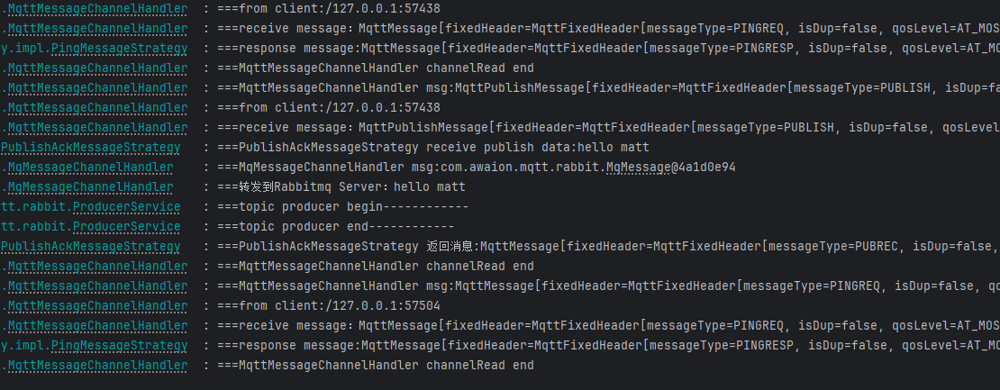

# Netty-MQTT

## 代码地址

- Gitee: https://gitee.com/Awaion/tools/tree/master/demo033
- Github: https://github.com/Awaion/tools/tree/master/demo033

## 简介

MQTT(Message Queuing Telemetry Transport,消息队列遥测传输)协议是一种轻量级的,基于发布/订阅(Publish/Subscribe)模式的即时通讯协议.
它最初由Andy Stanford-Clark和Arvid Norström为IBM开发,并在1999年首次公布.MQTT的设计目的是为了在资源受限的环境中提供高效的消息传输,如卫星
链路,蜂窝网络,以及硬件资源受限的机器间通信,这些场景通常具有低带宽,高延迟或不稳定的网络连接.

MQTT协议的关键特性包括:

- 发布/订阅模型:MQTT使用一个中心化的消息代理(Broker)作为消息交换的中介.消息的发送方(发布者)向特定的主题(Topic)发布消息,而消息的接收方
(订阅者)则订阅感兴趣的主题.当发布者向某个主题发布消息时,所有订阅该主题的订阅者都会接收到这条消息.
- 轻量级:MQTT协议设计得非常精简,可以使用极少的代码实现,这使得它非常适合在资源受限的设备上运行,如嵌入式系统.
- 可靠性:MQTT提供了不同的服务质量(Quality of Service,QoS)级别,允许消息在不同级别的可靠性下传输,从“尽力而为”到“确保交付”.
- 持久性:MQTT支持持久性会话,这意味着即使在断线后,客户端再次上线时仍可以恢复其状态和订阅.
- 安全性:MQTT可以通过SSL/TLS加密传输数据,确保消息的安全性.
- 可扩展性:MQTT架构可以轻松地支持数百万个设备和数千个并发连接.

由于这些特性,MQTT成为物联网(IoT)领域中最常用的协议之一,被广泛应用于智能家居,工业自动化,环境监控,远程医疗等各种场景中.



## 集成步骤

服务端

```text
pom.xml
<dependency>
    <groupId>io.netty</groupId>
    <artifactId>netty-all</artifactId>
    <version>4.1.63.Final</version>
</dependency>

application.properties
mqtt.serverIp=127.0.0.1
mqtt.serverPort=1883

public interface MessageStrategy {
    void sendResponseMessage(ChannelHandlerContext channelHandlerContext, MqttMessage mqttMessage);
}

@Slf4j
@Component
public class MessageStrategyManager {
    public Map<MqttMessageType, MessageStrategy> messageStrategyMap = new HashMap<>();

    //根据消息类型获取对应的策略类
    public MessageStrategy getMessageStrategy(MqttMessageType messageType) {
        switch (messageType) {
            case CONNECT:
                return new ConnectAckMessageStrategy();
            case PUBLISH:
                return new PublishAckMessageStrategy();
            case PUBREL:
                return new PublishCompleteMessageStrategy();
            case SUBSCRIBE:
                return new SubscribeAckMessageStrategy();
            case UNSUBSCRIBE:
                return new UnSubscribeAckMessageStrategy();
            case PINGREQ:
                return new PingMessageStrategy();
            default:
                return null;
        }
    }

    //根据消息类型获取返回消息的类型
    private static MqttMessageType getResMqttMessageType(MqttMessageType messageType) {
        switch (messageType) {
            case CONNECT:
                return MqttMessageType.CONNACK;
            case PUBLISH:
                return MqttMessageType.PUBACK;
            case PUBREL:
                return MqttMessageType.PUBLISH;
            case SUBSCRIBE:
                return MqttMessageType.SUBACK;
            case UNSUBSCRIBE:
                return MqttMessageType.UNSUBACK;
            case PINGREQ:
                return MqttMessageType.PINGRESP;
            default:
                return null;
        }
    }
}

@ChannelHandler.Sharable
@Component
@Slf4j
public class MqMessageChannelHandler extends ChannelInboundHandlerAdapter {
    // 消息队列请求处理器
    @Autowired
    ProducerService producerService;

    @Override
    public void channelRead(ChannelHandlerContext ctx, Object msg) {
        log.info("===MqMessageChannelHandler msg:{}", msg);
        if (!(msg instanceof MqMessage)) {
            return;
        }
        MqMessage mqMessage = (MqMessage) msg;
        log.info("===转发到Rabbitmq Server:" + mqMessage.data);
        producerService.sendData(mqMessage.data);
    }

}

@Component
@Slf4j
@ChannelHandler.Sharable
public class MqttMessageChannelHandler extends ChannelInboundHandlerAdapter {
    // MQTT(Message Queuing Telemetry Transport,消息队列遥测传输)协议处理器
    @Autowired
    MessageStrategyManager messageStrategyManager;

    @Override
    public void channelRead(ChannelHandlerContext channelHandlerContext, Object msg) {
        log.info("===MqttMessageChannelHandler msg:{}", msg);
        if (!(msg instanceof MqttMessage)) {
            return;
        }

        MqttMessage mqttMessage = (MqttMessage) msg;
        log.info("===from client:" + channelHandlerContext.channel().remoteAddress());
        log.info("===receive message:" + mqttMessage);
        try {
            MqttMessageType type = mqttMessage.fixedHeader().messageType();
            // 返回对于消息处理器对象
            MessageStrategy messageStrategy = messageStrategyManager.getMessageStrategy(type);
            if (messageStrategy != null) {
                messageStrategy.sendResponseMessage(channelHandlerContext, mqttMessage);
            }
        } catch (Exception e) {
            e.printStackTrace();
        }
        log.info("===MqttMessageChannelHandler channelRead end");

    }

    @Override
    public void exceptionCaught(ChannelHandlerContext ctx, Throwable cause) { // (4)
        // 当出现异常就关闭连接
        cause.printStackTrace();
        ctx.close();
    }
}

@Component
public class TCPServerChannelInitializer extends ChannelInitializer<SocketChannel> {
    @Autowired
    MqttMessageChannelHandler mqttMessageChannelHandler;
    @Autowired
    MqMessageChannelHandler mqMessageChannelHandler;

    public TCPServerChannelInitializer() {
        super();
    }

    @Override
    protected void initChannel(SocketChannel socketChannel) {
        // 频道流水线添加处理器
        socketChannel.pipeline().addLast("===mqttDecoder", new MqttDecoder());
        socketChannel.pipeline().addLast("===mqttEncoder", MqttEncoder.INSTANCE);
        //心跳超时控制
        socketChannel.pipeline().addLast("idle",
                new IdleStateHandler(15, 0, 0, TimeUnit.MINUTES));
        socketChannel.pipeline().addLast("===mqttHandler", mqttMessageChannelHandler);
        socketChannel.pipeline().addLast("===mqHandler", mqMessageChannelHandler);
    }
}

public void start() {
    log.info("mqtt server start:" + serverPort);
    bossGroup = new NioEventLoopGroup();
    workGroup = new NioEventLoopGroup();

    try {
        ServerBootstrap serverBootstrap = new ServerBootstrap();

        serverBootstrap.group(bossGroup, workGroup)
                .channel(NioServerSocketChannel.class)
                .childHandler(tcpServerChannelInitializer)
                .option(ChannelOption.SO_BACKLOG, 128)
                .childOption(ChannelOption.SO_KEEPALIVE, true);

        // 绑定端口,开始接收进来的连接
        channelFuture = serverBootstrap.bind(serverPort).sync();

    } catch (Exception e) {
        e.printStackTrace();
    }
}
```

客户端发送消息

```text
<dependency>
    <groupId>io.github.xzc-coder</groupId>
    <artifactId>netty-mqtt-client</artifactId>
    <version>1.1.0</version>
</dependency>

@RestController
public class MqttController {
    private MqttClient client;

    public MqttController() {
        //创建MQTT全局配置器(也可以不创建)
        MqttConfiguration mqttConfiguration = new MqttConfiguration(2);
        //创建MQTT客户端工厂
        MqttClientFactory mqttClientFactory = new DefaultMqttClientFactory(mqttConfiguration);
        //使用内存消息存储器(默认)
        MqttMsgStore mqttMsgStore = new MemoryMqttMsgStore();
        mqttClientFactory.setMqttMsgStore(mqttMsgStore);
        //创建连接参数,设置客户端ID
        //创建连接参数,设置客户端ID
        MqttConnectParameter mqttConnectParameter = new MqttConnectParameter("netty-client-mqtt-test");
        //设置客户端版本(默认为3.1.1)
        mqttConnectParameter.setMqttVersion(MqttVersion.MQTT_3_1_1);
        //是否自动重连
        mqttConnectParameter.setAutoReconnect(true);
        //Host
        mqttConnectParameter.setHost("127.0.0.1");
        //端口
        mqttConnectParameter.setPort(1883);
        //是否使用SSL/TLS
        mqttConnectParameter.setSsl(false);
        //遗嘱消息
        MqttWillMsg mqttWillMsg = new MqttWillMsg("test", "hello matt2".getBytes(), MqttQoS.EXACTLY_ONCE);
        mqttConnectParameter.setWillMsg(mqttWillMsg);
        //是否清除会话
        mqttConnectParameter.setCleanSession(true);
        //心跳间隔
        mqttConnectParameter.setKeepAliveTimeSeconds(60);
        //连接超时时间
        mqttConnectParameter.setConnectTimeoutSeconds(30);
        //创建一个客户端
        MqttClient mqttClient = mqttClientFactory.createMqttClient(mqttConnectParameter);
        //添加回调器
        mqttClient.addMqttCallback(new DefaultMqttCallback());
        mqttClient.connect();
        client = mqttClient;
    }

    @GetMapping("/sendMessage")
    public String sendMessage() {
        // http://localhost:8081/sendMessage
        client.publishFuture(new MqttMsgInfo("test", "hello matt".getBytes(), MqttQoS.EXACTLY_ONCE));
        return "success";
    }
}
```

#### 后端

| 技术           | 官网                                   |
|--------------|--------------------------------------|
| SpringBoot   | https://spring.io/projects/spring-boot |
| netty        | https://netty.io/ |

#### 开发工具

| 工具   | 说明    | 官网                                      |
|------|-------|-----------------------------------------|
| IDEA | 开发IDE | https://www.jetbrains.com/idea/download |

#### 开发环境

| 工具  | 版本号 | 下载                                                         |
|-----|-----|------------------------------------------------------------|
| JDK | 17  | https://www.oracle.com/java/technologies/downloads/#java17 |

#### 启动方式

main

## 许可证

[MIT License](https://opensource.org/license/mit)

Copyright (c) 2024-2024 Awaion

